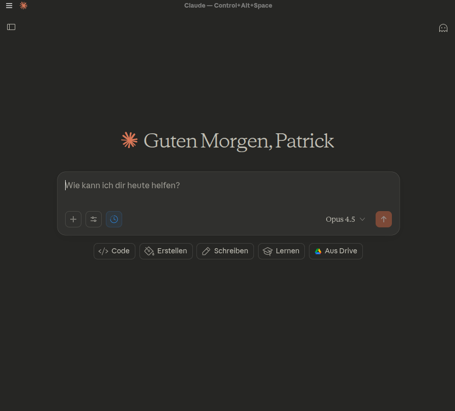
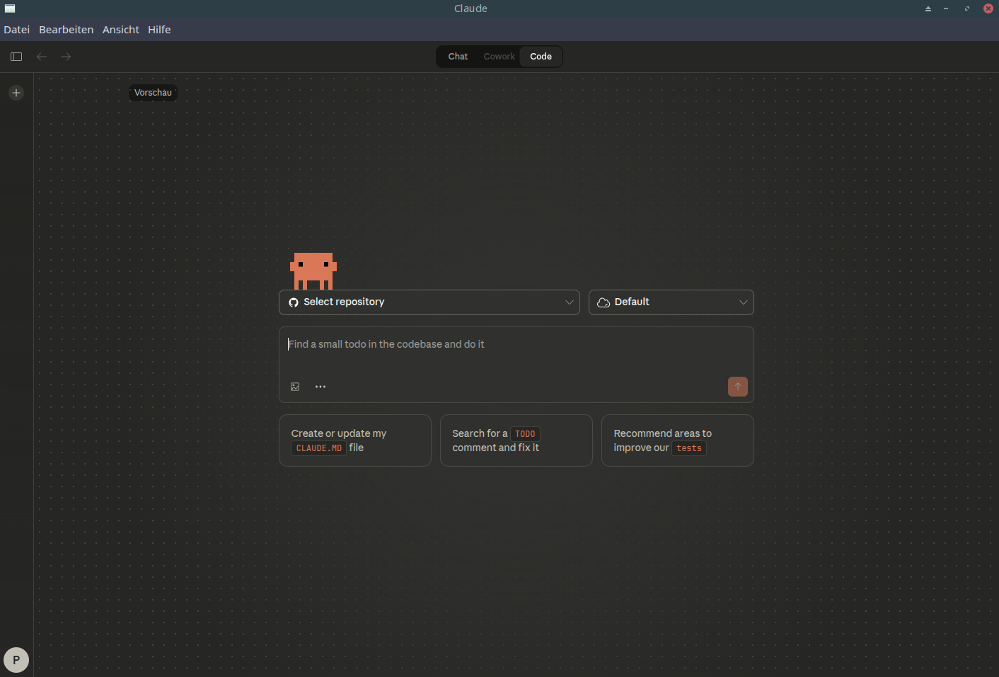

# Claude Desktop for Linux

[](https://aur.archlinux.org/packages/claude-desktop-bin)
[](https://github.com/patrickjaja/claude-desktop-bin/actions/workflows/update-aur.yml)

Unofficial Linux packages for Claude Desktop AI assistant with automated updates.

## Installation

### Arch Linux / Manjaro (AUR)
```bash
yay -S claude-desktop-bin
```
Updates arrive through your AUR helper (e.g. `yay -Syu`).

### Debian / Ubuntu (APT Repository)
```bash
# Add repository (one-time setup)
curl -fsSL https://patrickjaja.github.io/claude-desktop-bin/install.sh | sudo bash

# Install
sudo apt install claude-desktop-bin
```
Updates are automatic via `sudo apt update && sudo apt upgrade`.

<details>
<summary>Manual .deb install (without APT repo)</summary>

```bash
wget https://github.com/patrickjaja/claude-desktop-bin/releases/latest/download/claude-desktop-bin_1.1.4088_amd64.deb
sudo dpkg -i claude-desktop-bin_*_amd64.deb
```
</details>

### Fedora / RHEL (.rpm)
```bash
# Download from GitHub Releases
wget https://github.com/patrickjaja/claude-desktop-bin/releases/latest/download/claude-desktop-bin-1.1.4088-1.x86_64.rpm
sudo dnf install ./claude-desktop-bin-*-1.x86_64.rpm
```

> **Note:** No automatic updates. Download the latest `.rpm` from [GitHub Releases](https://github.com/patrickjaja/claude-desktop-bin/releases) to update.

### NixOS / Nix
```bash
# Try without installing
nix run github:patrickjaja/claude-desktop-bin

# Or add to flake.nix
nix profile install github:patrickjaja/claude-desktop-bin
```

<details>
<summary>NixOS flake configuration</summary>

```nix
{
  inputs.claude-desktop.url = "github:patrickjaja/claude-desktop-bin";

  # In your system config:
  environment.systemPackages = [
    inputs.claude-desktop.packages.x86_64-linux.default
  ];
}
```
</details>

> **Note:** Update by running `nix flake update` to pull the latest version. `nix run` always fetches the latest.

### AppImage (Any Distro)
```bash
# Download from GitHub Releases
wget https://github.com/patrickjaja/claude-desktop-bin/releases/latest/download/Claude_Desktop-1.1.4088-x86_64.AppImage
chmod +x Claude_Desktop-*-x86_64.AppImage
./Claude_Desktop-*-x86_64.AppImage
```

> **Note:** AppImage does not receive automatic updates. Download the latest release manually to update.

### From Source
```bash
git clone https://github.com/patrickjaja/claude-desktop-bin.git
cd claude-desktop-bin
./scripts/build-local.sh --install
```

> **Note:** Source builds do not receive automatic updates. Pull and rebuild to update.

## Features
- Native Linux support (Arch, Debian/Ubuntu, Fedora/RHEL, NixOS, AppImage)
- **Claude Code CLI integration** - Auto-detects system-installed Claude Code
- **Local Agent Mode** - Git worktrees and agent sessions
- **Cowork support** - Agentic workspace feature enabled on Linux (requires [claude-cowork-service](https://github.com/patrickjaja/claude-cowork-service))
- **MCP server support** - Model Context Protocol servers work on Linux
- Global hotkey support (Ctrl+Alt+Space) with multi-monitor awareness
- Automated daily version checks

## Claude Chat

The main Chat tab running natively on Linux.



## Claude Code Integration

This package patches Claude Desktop to work with system-installed Claude Code on Linux.



To use Claude Code (and Cowork) features, install the CLI following the [official setup guide](https://code.claude.com/docs/en/setup), then verify it's accessible:
```bash
which claude  # e.g. ~/.local/bin/claude, /usr/bin/claude, /usr/local/bin/claude
```

The patch auto-detects claude in `/usr/bin`, `~/.local/bin`, and `/usr/local/bin`.

## Cowork Integration (Experimental)

Cowork is Claude Desktop's agentic workspace feature. This package patches it to work on Linux using a native backend daemon instead of the macOS/Windows VM.


Requires Claude Code CLI (see above) and [claude-cowork-service](https://github.com/patrickjaja/claude-cowork-service):

**Any distro (quick install):**
```bash
curl -fsSL https://raw.githubusercontent.com/patrickjaja/claude-cowork-service/main/scripts/install.sh | bash
```

**Arch Linux (AUR):**
```bash
yay -S claude-cowork-service
systemctl --user enable --now claude-cowork
```

## Patches

The package applies several patches to make Claude Desktop work on Linux. Each patch is isolated in `patches/` for easy maintenance:

| Patch | Purpose | Break risk | Debug pattern |
|-------|---------|------------|---------------|
| `claude-native.js` | Linux-compatible native module (replaces Windows-only `@anthropic/claude-native`) | LOW | Static file, no regex |
| `enable_local_agent_mode.py` | Enables Local Agent Mode (chillingSlothFeat) on Linux for git worktrees and agent sessions | HIGH | `rg -o 'function \w+\(\)\{return process\.platform.*status' index.js` |
| `fix_app_quit.py` | Fixes app not quitting after cleanup on Linux (uses `app.exit(0)` instead of `app.quit()`) | LOW | Uses `app.quit()` literal |
| `fix_claude_code.py` | Enables Claude Code CLI integration by detecting system-installed claude binary | MED | `rg -o 'async getStatus\(\)\{.{0,200}' index.js` |
| `fix_cowork_error_message.py` | Replaces Windows VM errors with Linux-friendly guidance for claude-cowork-service | LOW | Uses string literals |
| `fix_cowork_linux.py` | Enables Cowork on Linux: VM client loader, Unix socket path, bundle config, claude binary resolution | HIGH | `rg -o '.{0,50}vmClient.{0,50}' index.js` |
| `fix_cross_device_rename.py` | Fixes EXDEV errors when moving VM bundles across filesystems (tmpfs to ext4) | LOW | Uses `.rename(` literal |
| `fix_disable_autoupdate.py` | Disables auto-updater on Linux (no Windows installer available) | MED | `rg -o '.{0,40}isInstalled.{0,40}' index.js` |
| `fix_locale_paths.py` | Redirects locale file paths to Linux install location | LOW | Uses `process.resourcesPath` literal |
| `fix_marketplace_linux.py` | Forces host CLI runner for marketplace operations on Linux (Browse Plugins, Manage) | HIGH | `rg -o 'function \w+\(\w+\)\{return\(\w+==null.*mode.*ccd' index.js` |
| `fix_native_frame.py` | Uses native window frames on Linux/XFCE while preserving Quick Entry transparency | MED | `rg -o 'titleBarStyle.{0,30}' index.js` |
| `fix_node_host.py` | Fixes MCP server node host path for Linux (uses `app.getAppPath()`) | LOW | `rg -o 'nodeHostPath.{0,50}' index.js` |
| `fix_quick_entry_position.py` | Spawns Quick Entry window on the monitor where the cursor is located | MED | `rg -o 'getPrimaryDisplay.{0,50}' index.js` |
| `fix_startup_settings.py` | Skips startup settings on Linux to avoid validation errors | LOW | `rg -o 'isStartupOnLoginEnabled.{0,50}' index.js` |
| `fix_tray_dbus.py` | Prevents DBus race conditions with mutex guard and cleanup delay | HIGH | `rg -o 'menuBarEnabled.*function' index.js` |
| `fix_tray_icon_theme.py` | Uses theme-aware tray icon selection (light/dark) on Linux | LOW | `rg -o 'nativeTheme.{0,50}tray' index.js` |
| `fix_tray_path.py` | Redirects tray icon path to package directory on Linux | MED | `rg -o 'function \w+\(\)\{return \w+\.app\.isPackaged' index.js` |
| `fix_utility_process_kill.py` | Uses SIGKILL as fallback when UtilityProcess doesn't exit gracefully | LOW | Uses `.kill(` literal |
| `fix_vm_session_handlers.py` | Global uncaught exception handler for VM session safety | LOW | `rg -o 'uncaughtException.{0,50}' index.js` |

When Claude Desktop updates break a patch, only the specific patch file needs updating. The **debug pattern** column shows the `rg` command to find the relevant code in the new version's `index.js`.

## Automation
This repository automatically:
- Checks for new Claude Desktop versions daily
- **Validates all patches in Docker** before pushing to AUR
- Updates the AUR package when new versions are detected
- Creates GitHub releases for tracking updates
- Maintains proper SHA256 checksums

### Patch Validation

The CI pipeline includes a test build step that validates patches before updating AUR:

1. **Docker Test Build** - Runs `makepkg` in an `archlinux:base-devel` container
2. **Pattern Matching Validation** - Each patch exits with code 1 if patterns don't match
3. **Pipeline Stops on Failure** - Broken packages never reach AUR users
4. **Build Logs Uploaded** - Artifacts available for debugging failures

If upstream Claude Desktop changes break a patch:
- The pipeline fails with clear `[FAIL]` output
- Build logs show which pattern didn't match
- AUR package remains unchanged until patches are updated

## Repository Structure
- `.github/workflows/` - GitHub Actions for automation
- `scripts/` - Build and validation scripts
- `patches/` - Linux compatibility patches
- `packaging/` - Debian, RPM, AppImage, and Nix build scripts
- `PKGBUILD.template` - AUR package template

## Wayland: Global Shortcut Not Working

On pure Wayland compositors (e.g. Hyprland, Sway), the Quick Entry shortcut (Ctrl+Alt+Space) doesn't work because Electron's `globalShortcut` relies on X11. Force XWayland mode to fix it:

```bash
claude-desktop --ozone-platform=x11
```

To make it persistent, edit `~/.local/share/applications/claude-desktop.desktop`:
```ini
Exec=claude-desktop --ozone-platform=x11 %u
```

## Tips
- Press **Alt** to toggle the app menu bar (Electron default)

## See Also

- [tweakcc](https://github.com/Piebald-AI/tweakcc) — A great CLI tool for customizing Claude Code (system prompts, themes, UI). Same patching-JS-to-make-it-yours energy. Thanks to the Piebald team for their work.

## Notes
- Unofficial package, not supported by Anthropic
- Issues: https://github.com/patrickjaja/claude-desktop-bin/issues
- Based on: https://github.com/k3d3/claude-desktop-linux-flake
