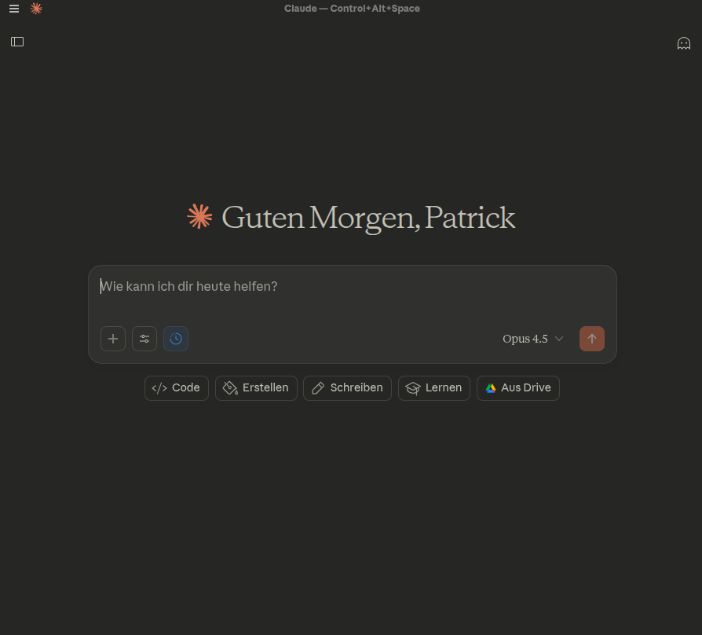
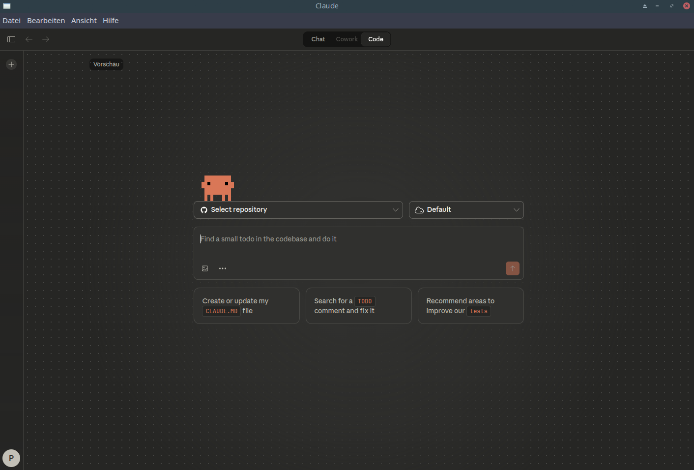

# Claude Desktop for Linux

[](https://claude.ai/download)
[](https://aur.archlinux.org/packages/claude-desktop-bin)
[](https://github.com/patrickjaja/claude-desktop-bin#debian--ubuntu-apt-repository)
[](https://github.com/patrickjaja/claude-desktop-bin#fedora--rhel-dnf-repository)
[](https://github.com/patrickjaja/claude-desktop-bin#appimage-any-distro)
[](https://github.com/patrickjaja/claude-desktop-bin#nixos--nix)
[](https://github.com/patrickjaja/claude-desktop-bin/actions/workflows/build-and-release.yml)

Unofficial Linux packages for Claude Desktop AI assistant with automated updates.

## Installation

> After installing, see [Optional Dependencies](#optional-dependencies) to enable Computer Use, Cowork, and more.

### Arch Linux / Manjaro (AUR)
```bash
yay -S claude-desktop-bin

# Optional: Computer Use dependencies
# Pick the line matching your session type (echo $XDG_SESSION_TYPE and echo $XDG_CURRENT_DESKTOP):
# X11/XWayland:
sudo pacman -S --needed xdotool scrot imagemagick wmctrl
# Wayland (wlroots — Sway, Hyprland):
sudo pacman -S --needed ydotool grim jq hyprland
# Wayland (KDE Plasma):
sudo pacman -S --needed ydotool xdotool spectacle imagemagick
# Wayland (GNOME):
sudo pacman -S --needed ydotool xdotool glib2 gnome-screenshot
# Optional: socat (cowork socket health checks, has fallback)
# sudo pacman -S --needed socat
```
On Wayland, the `ydotoold` daemon must be running — see [ydotool setup](#ydotool-setup-wayland).

Updates arrive through your AUR helper (e.g. `yay -Syu`).

### Debian / Ubuntu (APT Repository)
```bash
# Add repository (one-time setup)
curl -fsSL https://patrickjaja.github.io/claude-desktop-bin/install.sh | sudo bash

# Install
sudo apt install claude-desktop-bin

# Optional: Computer Use dependencies
# Pick the line matching your session type (echo $XDG_SESSION_TYPE and echo $XDG_CURRENT_DESKTOP):
# X11/XWayland:
sudo apt install xdotool scrot imagemagick wmctrl
# Wayland (wlroots — Sway, Hyprland):
sudo apt install ydotool grim jq hyprland
# Wayland (KDE Plasma):
sudo apt install ydotool xdotool kde-spectacle imagemagick
# Wayland (GNOME):
sudo apt install ydotool xdotool libglib2.0-bin gnome-screenshot
# Optional: socat (cowork socket health checks, has fallback)
# sudo apt install socat
```

> **Wayland users:** Computer Use requires ydotool v1.0+, but Ubuntu/Debian ship v0.1.8 which is **too old**. Run the [ydotool setup script](#ydotool-setup-wayland) — without this, clicks will not work.

Updates are automatic via `sudo apt update && sudo apt upgrade`.

<details>
<summary>Manual .deb install (without APT repo)</summary>

```bash
wget https://github.com/patrickjaja/claude-desktop-bin/releases/latest/download/claude-desktop-bin_1.1.9669-8_amd64.deb
sudo dpkg -i claude-desktop-bin_*_amd64.deb
```
</details>

### Fedora / RHEL (DNF Repository)
```bash
# Add repository (one-time setup)
curl -fsSL https://patrickjaja.github.io/claude-desktop-bin/install-rpm.sh | sudo bash

# Install
sudo dnf install claude-desktop-bin

# Optional: Computer Use dependencies
# Pick the line matching your session type (echo $XDG_SESSION_TYPE and echo $XDG_CURRENT_DESKTOP):
# X11/XWayland:
sudo dnf install xdotool scrot ImageMagick wmctrl
# Wayland (wlroots — Sway, Hyprland):
sudo dnf install ydotool grim jq hyprland
# Wayland (KDE Plasma):
sudo dnf install ydotool xdotool spectacle ImageMagick
# Wayland (GNOME):
sudo dnf install ydotool xdotool glib2 gnome-screenshot
# Optional: socat (cowork socket health checks, has fallback)
# sudo dnf install socat
```
On Wayland, the `ydotoold` daemon must be running — see [ydotool setup](#ydotool-setup-wayland).

Updates are automatic via `sudo dnf upgrade`.

<details>
<summary>Manual .rpm install (without DNF repo)</summary>

```bash
wget https://github.com/patrickjaja/claude-desktop-bin/releases/latest/download/claude-desktop-bin-1.1.9669-8.x86_64.rpm
sudo dnf install ./claude-desktop-bin-*.x86_64.rpm
```
</details>

### NixOS / Nix
```bash
# Try without installing
nix run github:patrickjaja/claude-desktop-bin

# Or add to flake.nix
nix profile install github:patrickjaja/claude-desktop-bin
```

For Computer Use, pass optional dependencies via override. Pick the block matching your session type (`echo $XDG_SESSION_TYPE` and `echo $XDG_CURRENT_DESKTOP`):
```nix
claude-desktop.override {
  # X11/XWayland:
  xdotool = pkgs.xdotool; scrot = pkgs.scrot;
  imagemagick = pkgs.imagemagick; wmctrl = pkgs.wmctrl;
  # Wayland (wlroots — Sway, Hyprland):
  # ydotool = pkgs.ydotool; grim = pkgs.grim; jq = pkgs.jq;
  # hyprland = pkgs.hyprland;
  # Wayland (KDE Plasma):
  # ydotool = pkgs.ydotool; xdotool = pkgs.xdotool;
  # spectacle = pkgs.kdePackages.spectacle; imagemagick = pkgs.imagemagick;
  # Wayland (GNOME):
  # ydotool = pkgs.ydotool; xdotool = pkgs.xdotool;
  # glib = pkgs.glib; gnome-screenshot = pkgs.gnome-screenshot;
  # Optional: socat (cowork socket health checks, has fallback)
  # socat = pkgs.socat;
}
```

<details>
<summary>NixOS flake configuration</summary>

```nix
{
  inputs.claude-desktop.url = "github:patrickjaja/claude-desktop-bin";

  # In your system config:
  environment.systemPackages = [
    inputs.claude-desktop.packages.x86_64-linux.default
  ];
}
```
</details>

> **Note:** Update by running `nix flake update` to pull the latest version. `nix run` always fetches the latest.

> **Dispatch/Cowork:** Requires Claude Code >= 2.1.86 (fixes `CLAUDE_CODE_BRIEF` env parsing). If nixpkgs ships an older version, [install Claude Code manually](https://docs.anthropic.com/en/docs/claude-code/overview) and override with `extraSessionPaths`:
> ```nix
> claude-desktop.override {
>   extraSessionPaths = [ "/path/to/directory/containing/claude" ];
> }
> ```

### AppImage (Any Distro)
```bash
# Download from GitHub Releases
wget https://github.com/patrickjaja/claude-desktop-bin/releases/latest/download/Claude_Desktop-1.1.9669-x86_64.AppImage
chmod +x Claude_Desktop-*-x86_64.AppImage
./Claude_Desktop-*-x86_64.AppImage
```

> **Computer Use:** Install optional dependencies using your distro's package manager — see the [Computer Use packages table](#optional-dependencies). On Wayland, `ydotool` v1.0+ is required — see [ydotool setup](#ydotool-setup-wayland).

> **Update:** AppImage supports delta updates via [appimageupdatetool](https://github.com/AppImageCommunity/AppImageUpdate). Only changed blocks are downloaded.
> ```bash
> appimageupdatetool Claude_Desktop-*-x86_64.AppImage
> # Or from within the AppImage:
> ./Claude_Desktop-*-x86_64.AppImage --appimage-update
> ```
> Compatible with [AppImageLauncher](https://github.com/TheAssassin/AppImageLauncher) and [Gear Lever](https://github.com/mijorus/gearlever) for automatic update notifications.

### From Source
```bash
git clone https://github.com/patrickjaja/claude-desktop-bin.git
cd claude-desktop-bin
./scripts/build-local.sh --install
```

> **Note:** Source builds do not receive automatic updates. Pull and rebuild to update.

### ARM64 / aarch64 (NVIDIA DGX Spark, Jetson, etc.)

ARM64 .deb and .rpm packages are available for platforms like **NVIDIA DGX Spark** (Ubuntu 24.04 arm64) and **Jetson** (JetPack/Ubuntu 22.04 arm64).

```bash
# Debian/Ubuntu ARM64 (via APT repo)
curl -fsSL https://patrickjaja.github.io/claude-desktop-bin/install.sh | sudo bash
sudo apt install claude-desktop-bin

# Fedora ARM64 (via DNF repo)
curl -fsSL https://patrickjaja.github.io/claude-desktop-bin/install-rpm.sh | sudo bash
sudo dnf install claude-desktop-bin
```

The APT and DNF repos serve both x86_64 and arm64 packages — your package manager picks the correct architecture automatically.

## Optional Dependencies

Claude Desktop works without these — features degrade gracefully when tools are missing.

| Feature | Packages | Notes |
|---------|----------|-------|
| **Computer Use** | See table below | Install manually for your session type (X11 or Wayland) — the app auto-detects which tools to call at runtime |
| **Cowork & Dispatch** | [`claude-cowork-service`](https://github.com/patrickjaja/claude-cowork-service) | Agentic workspace and mobile→desktop task orchestration |
| **Claude Code CLI** | [`claude`](https://code.claude.com/docs/en/setup) | Required for Code integration, Cowork, and Dispatch |
| **Browser Tools** | [Claude in Chrome extension](https://chromewebstore.google.com/detail/claude-code/fcoeoabgfenejglbffodgkkbkcdhcgfn) | Uses Claude Code's native host (`~/.claude/chrome/chrome-native-host`). Claude Code CLI must be installed |
| **Custom MCP Servers** | `nodejs` | Only needed for third-party MCP servers requiring system Node.js |

**Computer Use packages** — check your session type (`echo $XDG_SESSION_TYPE`) and desktop (`echo $XDG_CURRENT_DESKTOP`), then install the matching packages. At runtime, the app auto-detects your compositor and calls the correct tools.

| Operation | X11 / XWayland | Wayland — wlroots (Sway, Hyprland) | Wayland — GNOME | Wayland — KDE Plasma |
|-----------|---------------|-------------------------------------|-----------------|----------------------|
| Input automation | `xdotool` | `ydotool` (+ `ydotoold` running) | `ydotool` (+ `ydotoold` running) | `ydotool` (+ `ydotoold` running) |
| Screenshots | `scrot`, `imagemagick` | `grim` | `gdbus` (glib2), `gnome-screenshot` | `spectacle`, `imagemagick` |
| Clipboard | Electron API (built-in) | Electron API (built-in) | Electron API (built-in) | Electron API (built-in) |
| Display info | Electron API (built-in) | Electron API (built-in) | Electron API (built-in) | Electron API (built-in) |
| Window queries | `wmctrl` | `swaymsg` (Sway), `jq` | — | — |
| Cursor positioning | `xdotool` | `ydotool` | `xdotool` (read), `ydotool` (move) | `xdotool` (read), `ydotool` (move) |

> **GNOME:** `gdbus` (from glib2/libglib2.0-bin) provides the `org.gnome.Shell.Screenshot` D-Bus interface. `gnome-screenshot` is a fallback if D-Bus fails.
>
> **KDE:** `spectacle` captures screenshots. `imagemagick` (`convert`) crops to monitor region on multi-monitor setups.
>
> **Custom screenshot command:** Set `COWORK_SCREENSHOT_CMD` to override the auto-detection. Use placeholders `{FILE}` (output path), `{X}`, `{Y}`, `{W}`, `{H}` (region). Example: `COWORK_SCREENSHOT_CMD='spectacle -b -n -r -o {FILE}'`

<a id="ydotool-setup-wayland"></a>
### ydotool setup (Wayland — all compositors)

Computer Use needs `ydotool` **v1.0+** and the `ydotoold` daemon for mouse/keyboard input on Wayland. Without it, clicks won't reach native Wayland windows. Tested on KDE Plasma and GNOME.

**Arch Linux / Fedora** — ydotool v1.x ships in the repos:
```bash
# Arch
sudo pacman -S ydotool && sudo systemctl enable --now ydotool

# Fedora
sudo dnf install ydotool && sudo systemctl enable --now ydotool
```

**Ubuntu / Debian** — the repo ships v0.1.8 which is **incompatible**. Run the setup script to build and configure v1.0.4:
```bash
curl -fsSL https://raw.githubusercontent.com/patrickjaja/claude-desktop-bin/master/scripts/setup-ydotool.sh | sudo bash
```

**GNOME users** — also set flat mouse acceleration for accurate cursor positioning:
```bash
gsettings set org.gnome.desktop.peripherals.mouse accel-profile flat
```
> Note: this changes acceleration for all mice, not just ydotool. KDE handles this per-device automatically.

Restart Claude Desktop after setup.

## Features
- Native Linux support (Arch, Debian/Ubuntu, Fedora/RHEL, NixOS, AppImage) — **x86_64 and ARM64**, X11 and Wayland
- **Claude Code CLI integration** - Auto-detects system-installed Claude Code (requires [claude-code](https://code.claude.com/docs/en/setup))
- **Local Agent Mode** - Git worktrees and agent sessions
- **Cowork support** - Agentic workspace feature enabled on Linux (requires [claude-cowork-service](https://github.com/patrickjaja/claude-cowork-service))
- **Computer Use** - Desktop automation via built-in MCP server (27 tools: screenshot, click, type, scroll, drag, clipboard, multi-monitor switch, batch actions, teach mode). No permission grants needed — see [Optional Dependencies](#optional-dependencies) for required packages
- **Dispatch** - Send tasks from your phone to your desktop Claude via Anthropic's dispatch orchestrator agent (internally "Ditto"). Text responses, file delivery, task orchestration, and all SDK MCP tools work natively on Linux (requires [claude-cowork-service](https://github.com/patrickjaja/claude-cowork-service)). See [Dispatch Architecture](#dispatch-architecture) for details
- **Browser Tools (Chrome integration)** - 18 browser automation tools (navigate, read_page, javascript_tool, etc.) via the [Claude in Chrome](https://chromewebstore.google.com/detail/claude-code/fcoeoabgfenejglbffodgkkbkcdhcgfn) extension. Uses Claude Code's native messaging host (`~/.claude/chrome/chrome-native-host`) instead of the proprietary Windows/macOS binary
- **MCP server support** - Model Context Protocol servers work on Linux
- **Custom Themes (Experimental)** - 6 built-in color themes (Nord, Catppuccin Mocha/Frappe/Latte/Macchiato, Sweet) or create your own via JSON config — not all UI elements are fully themed yet
- **Multi-monitor Quick Entry** - Global hotkey (Ctrl+Alt+Space) opens on the monitor where your cursor is
- Automated daily version checks
- …and [33+ more patches](#patches) for native Linux integration (tray icons, window management, enterprise config, detected projects, and more)

## Claude Chat

The main Chat tab running natively on Linux.



## Claude Code Integration

This package patches Claude Desktop to work with system-installed Claude Code on Linux.



To use Claude Code (and Cowork) features, install the CLI following the [official setup guide](https://code.claude.com/docs/en/setup), then verify it's accessible:
```bash
which claude  # e.g. ~/.local/bin/claude, /usr/bin/claude, /usr/local/bin/claude
```

The patch auto-detects claude in `/usr/bin`, `~/.local/bin`, and `/usr/local/bin`.

## Cowork Integration

Cowork is Claude Desktop's agentic workspace feature. This package patches it to work on Linux using a native backend daemon instead of the macOS/Windows VM.


Requires Claude Code CLI (see above) and [claude-cowork-service](https://github.com/patrickjaja/claude-cowork-service). See its Installation section for distro-specific instructions ([APT](https://github.com/patrickjaja/claude-cowork-service#debian--ubuntu-apt-repository), [DNF](https://github.com/patrickjaja/claude-cowork-service#fedora--rhel-dnf-repository), [AUR](https://github.com/patrickjaja/claude-cowork-service#arch-linux-aur), [Nix](https://github.com/patrickjaja/claude-cowork-service#nixos), or [binary install](https://github.com/patrickjaja/claude-cowork-service#quick-install-any-distro-x86_64--arm64)).

## CoworkSpaces

CoworkSpaces organizes folders, projects, and links into named Spaces for Cowork sessions. On macOS/Windows this is handled by the native backend (`@ant/claude-swift`). On Linux, `fix_cowork_spaces.py` provides a full file-based implementation:

- Stores spaces in `~/.config/Claude/spaces.json`
- Full CRUD: create, update, delete spaces with folders, projects, and links
- File operations: list folder contents, read files, open with system handler
- Auto-memory directories per space (`~/.config/Claude/spaces/<id>/memory/`)
- Integrates with the SpaceManager singleton so `resolveSpaceContext` works for sessions

The Spaces UI is rendered by the claude.ai web frontend (loaded in the BrowserView).

## Computer Use

Claude Desktop includes a built-in Computer Use MCP server with 27 tools for desktop automation — screenshot, click, type, scroll, drag, clipboard, and more. The **learn tools** (`learn_application`, `learn_screen_region`) generate interactive overlay tutorials that walk through any application's UI elements step by step.

Example prompt: *"Can you use computer use MCP to explain me the PhpStorm application?"*

| Welcome | Menu Bar | Toolbar |
|---------|----------|---------|
|  |  |  |

**How it works on Linux:** Upstream Computer Use is macOS-only — gated behind `process.platform==="darwin"` checks, macOS TCC permissions, and a native Swift executor. The patch ([fix_computer_use_linux.py](patches/fix_computer_use_linux.py)) removes 3 platform gates, bypasses TCC with a no-op `{granted: true}`, and injects a Linux executor that auto-detects your session type and uses the right tools. See [Optional Dependencies](#optional-dependencies) for the full package list.

**App discovery** for the teach/learn overlay scans `.desktop` files from `/usr/share/applications`, `~/.local/share/applications`, and Flatpak directories. Each app is registered with multiple name variants (full name, first word, exec basename, icon name, .desktop filename) so the model can match apps flexibly (e.g., "Thunar" matches "Thunar File Manager").

**Multi-monitor limitation:** Computer Use on Linux is limited to the **primary monitor** only. Screenshots, clicks, and the teach overlay all target the primary display. On multi-monitor setups, coordinates are translated from display-relative to absolute screen space automatically. Use `switch_display` if you need to target a different monitor for screenshots/clicks, but the teach overlay always appears on primary.

**Teach overlay on Linux:** Since Electron's `setIgnoreMouseEvents(true, {forward: true})` is [broken on X11](https://github.com/electron/electron/issues/16777), the teach overlay stays fully interactive (buttons are clickable) but blocks clicks to apps behind it during the guided tour. The tooltip repositions between steps via `anchorLogical` coordinates pointing to UI elements.

See [CLAUDE_BUILT_IN_MCP.md](CLAUDE_BUILT_IN_MCP.md#14-computer-use) for the full tool reference and [Optional Dependencies](#optional-dependencies) for required packages.

## Custom Themes (Experimental)

Themes override CSS variables in **all windows** (main chat, Quick Entry, Find-in-Page, About) via Electron's `insertCSS()` API. Set Claude Desktop to **dark mode** for best results with dark themes.

**Quick start:**
```bash
echo '{"activeTheme": "sweet"}' > ~/.config/Claude/claude-desktop-bin.json
# Restart Claude Desktop
```

**Built-in themes:** `sweet`, `nord`, `catppuccin-mocha`, `catppuccin-frappe`, `catppuccin-latte`, `catppuccin-macchiato`

| Sweet | Nord | Catppuccin Mocha |
|-------|------|------------------|
| Purple/pink warm tones ([github.com/EliverLara/Sweet](https://github.com/EliverLara/Sweet)) | Arctic blue-grey ([nordtheme.com](https://nordtheme.com)) | Warm pastels ([catppuccin.com](https://catppuccin.com)) |

See **[themes/README.md](themes/README.md)** for the full theming guide: CSS variable reference, how to extract app HTML/CSS for inspection, custom theme creation, and screenshots.

## Patches

The package applies several patches to make Claude Desktop work on Linux. Each patch is isolated in `patches/` for easy maintenance:

| Patch | Purpose | Debug pattern |
|-------|---------|---------------|
| `add_feature_custom_themes.py` | CSS theme injection — 6 built-in themes (sweet, nord, catppuccin-*) | Prepended IIFE, no regex |
| `claude-native.js` | Linux stubs for `@anthropic/claude-native` (Windows-only module) | Static file, no regex |
| `enable_local_agent_mode.py` | Removes platform gates for Code/Cowork features, spoofs UA | `rg -o 'function \w+\(\)\{return process\.platform.*status' index.js` |
| `fix_0_node_host.py` | Fixes MCP node host and shell worker paths for Linux | `rg -o 'nodeHostPath.{0,50}' index.js` |
| `fix_app_quit.py` | Uses `app.exit(0)` to prevent hang on exit | `rg -o '.{0,50}app\.quit.{0,50}' index.js` |
| `fix_browse_files_linux.py` | Enables `openDirectory` in file dialog (upstream macOS-only) | `rg -o 'openDirectory.{0,60}' index.js` |
| `fix_browser_tools_linux.py` | Enables Chrome browser tools — redirects native host to Claude Code's wrapper | `rg -o '"Helpers".{0,50}' index.js` |
| `fix_claude_code.py` | Detects system-installed Claude Code binary | `rg -o 'async getStatus\(\)\{.{0,200}' index.js` |
| `fix_computer_use_linux.py` | Enables Computer Use — removes platform gates, injects Linux executor (grim/GNOME D-Bus/spectacle/scrot, xdotool/ydotool) | `rg -o 'process.platform.*darwin.*t7r' index.js` |
| `fix_computer_use_tcc.py` | Stubs macOS TCC permission handlers to prevent error logs | Prepended IIFE, UUID extraction |
| `fix_cowork_error_message.py` | Replaces Windows VM errors with Linux-friendly guidance | String literal match |
| `fix_cowork_linux.py` | Enables Cowork — VM client, Unix socket, bundle config, binary resolution | `rg -o '.{0,50}vmClient.{0,50}' index.js` |
| `fix_cowork_spaces.py` | File-based CoworkSpaces service (CRUD, file ops, events) | `rg -o 'CoworkSpaces' index.js` |
| `fix_cross_device_rename.py` | EXDEV fallback for cross-filesystem file moves | Uses `.rename(` literal |
| `fix_detected_projects_linux.py` | Enables detected projects with Linux IDE paths (VSCode, Cursor, Zed) | `rg -o 'detectedProjects.{0,50}' index.js` |
| `fix_disable_autoupdate.py` | Disables auto-updater (no Linux installer) | `rg -o '.{0,40}isInstalled.{0,40}' index.js` |
| `fix_dispatch_linux.py` | Enables Dispatch — forces bridge init, bypasses platform gate, forwards responses natively | `rg -o 'sessions-bridge.*init' index.js` |
| `fix_dock_bounce.py` | Suppresses taskbar attention-stealing on KDE/Wayland | Prepended IIFE, no regex |
| `fix_enterprise_config_linux.py` | Reads enterprise config from `/etc/claude-desktop/enterprise.json` | `rg -o 'enterprise.json' index.js` |
| `fix_locale_paths.py` | Redirects locale file paths to Linux install location | Global string replace on `process.resourcesPath` |
| `fix_marketplace_linux.py` | Forces host-local mode for plugin operations (no VM) | `rg -o 'function \w+\(\w+\)\{return\(\w+==null.*mode.*ccd' index.js` |
| `fix_native_frame.py` | Native window frames on Linux, preserves Quick Entry transparency | `rg -o 'titleBarStyle.{0,30}' index.js` |
| `fix_office_addin_linux.py` | Extends Office Addin MCP server to include Linux | `rg -o '.{0,30}louderPenguinEnabled.{0,30}' index.js` |
| `fix_process_argv_renderer.py` | Injects `process.argv=[]` in renderer preload to prevent TypeError | `rg -o '.{0,30}\.argv.{0,30}' mainView.js` |
| `fix_quick_entry_position.py` | Quick Entry opens on cursor's monitor (multi-monitor) | `rg -o 'getPrimaryDisplay.{0,50}' index.js` |
| ~~`fix_read_terminal_linux.py`~~ | **Removed in v1.2.234** — upstream now natively supports Linux | N/A |
| `fix_startup_settings.py` | Skips startup/login settings to avoid validation errors | `rg -o 'isStartupOnLoginEnabled.{0,50}' index.js` |
| `fix_tray_dbus.py` | Prevents DBus race conditions with mutex and cleanup delay | `rg -o 'menuBarEnabled.*function' index.js` |
| `fix_tray_icon_theme.py` | Theme-aware tray icon (light/dark) | `rg -o 'nativeTheme.{0,50}tray' index.js` |
| `fix_tray_path.py` | Redirects tray icon path to package directory | `rg -o 'function \w+\(\)\{return \w+\.app\.isPackaged' index.js` |
| `fix_updater_state_linux.py` | Adds version fields to idle updater state to prevent TypeError | `rg -o 'status:"idle".{0,50}' index.js` |
| `fix_utility_process_kill.py` | SIGKILL fallback when UtilityProcess doesn't exit gracefully | `rg -o 'Killing utiltiy proccess' index.js` |
| `fix_vm_session_handlers.py` | Global exception handler for VM session safety | Prepended IIFE with fallbacks |
| `fix_window_bounds.py` | Fixes BrowserView bounds on maximize/snap, Quick Entry blur | Injected IIFE, minimal regex |

When Claude Desktop updates break a patch, only the specific patch file needs updating. The **debug pattern** column shows the `rg` command to find the relevant code in the new version's `index.js`.

## Automation
This repository automatically:
- Checks for new Claude Desktop versions daily
- **Validates all patches in Docker** before pushing to AUR
- Updates the AUR package when new versions are detected
- Creates GitHub releases for tracking updates
- Maintains proper SHA256 checksums

### Patch Validation

The CI pipeline includes a test build step that validates patches before updating AUR:

1. **Docker Test Build** - Runs `makepkg` in an `archlinux:base-devel` container
2. **Pattern Matching Validation** - Each patch exits with code 1 if patterns don't match
3. **Pipeline Stops on Failure** - Broken packages never reach AUR users
4. **Build Logs Uploaded** - Artifacts available for debugging failures

If upstream Claude Desktop changes break a patch:
- The pipeline fails with clear `[FAIL]` output
- Build logs show which pattern didn't match
- AUR package remains unchanged until patches are updated

## Repository Structure
- `.github/workflows/` - GitHub Actions for automation
- `scripts/` - Build and validation scripts
- `patches/` - Linux compatibility patches
- `packaging/` - Debian, RPM, AppImage, and Nix build scripts
- `PKGBUILD.template` - AUR package template

## Environment Variables

| Variable | Values | Description |
|----------|--------|-------------|
| `CLAUDE_DISABLE_GPU` | `1`, `full` | Fix white screen on some GPU/driver combos ([#13](https://github.com/patrickjaja/claude-desktop-bin/issues/13)). `1` disables compositing only, `full` disables GPU entirely |
| `CLAUDE_USE_XWAYLAND` | `1` | Force XWayland instead of native Wayland |
| `CLAUDE_MENU_BAR` | `auto`, `visible`, `hidden` | Menu bar visibility (default: `auto`, toggle with Alt) |
| `CLAUDE_DEV_TOOLS` | `detach` | Open Chromium DevTools on launch |
| `CLAUDE_ELECTRON` | path | Override Electron binary path |
| `CLAUDE_APP_ASAR` | path | Override app.asar path |
| `ELECTRON_ENABLE_LOGGING` | `1` | Log Electron main process to stderr |

Set permanently in `~/.bashrc` or `~/.zshrc`, or pass per-launch: `CLAUDE_DISABLE_GPU=1 claude-desktop`

## Debugging

Runtime logs are written to `~/.config/Claude/logs/`:
| Log File | Description |
|----------|-------------|
| `main.log` | Main Electron process |
| `claude.ai-web.log` | BrowserView web content |
| `mcp.log` | MCP server communication |

```bash
# Tail logs in real-time
tail -f ~/.config/Claude/logs/main.log

# Search for errors across all logs
grep -ri 'error\|exception\|fatal' ~/.config/Claude/logs/

# Launch with DevTools + full logging
CLAUDE_DEV_TOOLS=detach ELECTRON_ENABLE_LOGGING=1 claude-desktop 2>&1 | tee /tmp/claude-debug.log
```

## Dispatch Architecture

Dispatch lets you send tasks from the Claude mobile app to your Linux desktop. It's fully native — no VM, no emulation.


Claude Desktop spawns a long-running **dispatch orchestrator agent** (Anthropic internally calls it "Ditto"). This agent receives messages from your phone, delegates work to child sessions, and sends responses back via `SendUserMessage`.

```
Phone → Anthropic API → SSE → Claude Desktop → Ditto agent (via cowork-service)
  ├── Ditto calls SendUserMessage → response appears on phone
  ├── Ditto calls mcp__dispatch__start_task → child session spawned
  │     └── Child does the work (code, files, research, etc.)
  │     └── Child completes → Ditto reads transcript → Ditto replies to phone
  └── Ditto has access to all SDK MCP servers (Gmail, Drive, Chrome, etc.)
```

On Windows/Mac, dispatch runs inside a VM. On Linux, [claude-cowork-service](https://github.com/patrickjaja/claude-cowork-service) handles it natively with several adaptations (stripping VM-only tool restrictions, path mapping, local `present_files` interception). See the [Dispatch Support](https://github.com/patrickjaja/claude-cowork-service#dispatch-support) section in claude-cowork-service for full technical details.

**History:** `SendUserMessage` was broken in CLI v2.1.79–2.1.85 ([anthropics/claude-code#35076](https://github.com/anthropics/claude-code/issues/35076)). Fixed in v2.1.86. See [SEND_USER_MESSAGE_STATUS.md](SEND_USER_MESSAGE_STATUS.md) for the investigation.

## Known Limitations

### Global hotkey on Sway / GNOME

The Ctrl+Alt+Space global hotkey works on X11, KDE, and Hyprland. On **Sway** and **GNOME**, the compositor doesn't yet implement the desktop portal GlobalShortcuts interface — the hotkey won't fire. Workaround: configure a compositor keybind to focus the Claude Desktop window, or set `CLAUDE_USE_XWAYLAND=1` to fall back to XWayland (where X11 hotkeys work).

## Tips
- Press **Alt** to toggle the app menu bar (Electron default)


## See Also

- [tweakcc](https://github.com/Piebald-AI/tweakcc) — A great CLI tool for customizing Claude Code (system prompts, themes, UI). Same patching-JS-to-make-it-yours energy. Thanks to the Piebald team for their work.

## Legal Notice

> This is an **unofficial community project** for educational and research purposes.
> Claude Desktop is proprietary software owned by **Anthropic PBC**.
>
> This repository contains only build scripts and patches — not the Claude Desktop
> application itself. The upstream binary is downloaded directly from Anthropic
> during the build process.
>
> This project is not affiliated with, endorsed by, or sponsored by Anthropic.
> "Claude" is a trademark of Anthropic PBC.
