# Claude Desktop for Linux

[](https://claude.ai/download)
[](https://github.com/patrickjaja/claude-desktop-bin/actions/workflows/build-and-release.yml)
[](https://patrickjaja.github.io/claude-desktop-bin/)
[](https://www.reddit.com/r/ClaudeAI/comments/1r871b0/claude_desktop_on_linux_chat_cowork_code/)

[](https://aur.archlinux.org/packages/claude-desktop-bin)
[](https://github.com/patrickjaja/claude-desktop-bin#debian--ubuntu-apt-repository)
[](https://github.com/patrickjaja/claude-desktop-bin#fedora--rhel-dnf-repository)
[](https://github.com/patrickjaja/claude-desktop-bin#appimage-any-distro)
[](https://github.com/patrickjaja/claude-desktop-bin#nixos--nix)

Unofficial Linux packages for Claude Desktop AI assistant with automated updates.

This project repackages [Anthropic's official Claude Desktop Linux `.deb`](https://code.claude.com/docs/en/desktop-linux) for the distros Anthropic does not ship directly (Arch/AUR, Fedora/RHEL, NixOS, AppImage, and our own Debian/Ubuntu `.deb`), and layers on Linux-only extras: [Computer Use](#computer-use), [custom themes](#custom-themes), [multiple profiles](#multiple-profiles), and [Quick Entry](#known-limitations). If you run Ubuntu 22.04+/Debian 12+ and only need the base app, Anthropic's [official `.deb`](https://code.claude.com/docs/en/desktop-linux) works directly.

<details>
<summary><b>Table of contents</b></summary>

- [Installation](#installation)
- [Optional Dependencies](#optional-dependencies)
- [Features](#features)
  - [Custom Features](#custom-features)
- [Claude Chat](#claude-chat)
- [Claude Code Integration](#claude-code-integration)
- [Cowork Integration](#cowork-integration)
- [CoworkSpaces](#coworkspaces)
- [Computer Use](#computer-use)
- [Hardware Buddy (Nibblet)](#hardware-buddy-nibblet)
- [Third-Party Inference](#third-party-inference)
- [Custom Themes](#custom-themes)
- [Patches](#patches)
- [Automation](#automation)
- [Repository Structure](#repository-structure)
- [Multiple Profiles](#multiple-profiles)
  - [Quick start](#quick-start)
  - [The default (unnamed) profile](#the-default-unnamed-profile)
  - [Named profiles](#named-profiles)
  - [Selecting a profile at launch](#selecting-a-profile-at-launch)
  - [What's isolated](#whats-isolated)
  - [Removing a profile](#removing-a-profile)
  - [SSO and URL routing](#sso-and-url-routing)
  - [Limitations](#limitations)
  - [Why a copy of the binary?](#why-a-copy-of-the-binary)
- [Environment Variables](#environment-variables)
- [Debugging](#debugging)
- [Dispatch Architecture](#dispatch-architecture)
- [Known Limitations](#known-limitations)
- [Tips](#tips)
- [See Also](#see-also)
- [Legal Notice](#legal-notice)

</details>

## Installation

> After installing, see [Optional Dependencies](#optional-dependencies) to enable Computer Use, Cowork, and more.

### Arch Linux / Manjaro (AUR)
```bash
yay -S claude-desktop-bin

# Optional: Computer Use dependencies
# Pick the line matching your session type (echo $XDG_SESSION_TYPE and echo $XDG_CURRENT_DESKTOP):
# X11/XWayland:
sudo pacman -S --needed xdotool scrot imagemagick wmctrl
# Wayland (Sway):
sudo pacman -S --needed ydotool grim jq
# Wayland (Hyprland):
sudo pacman -S --needed ydotool grim hyprland
# Wayland (KDE Plasma) - no extra packages needed
# Wayland (GNOME):
sudo pacman -S --needed ydotool xdotool glib2 gnome-screenshot imagemagick python-gobject gst-plugin-pipewire
# GNOME Wayland: enable Quick Entry hotkey (one-time, after install):
# claude-desktop --install-gnome-hotkey
# Optional: socat (faster Quick Entry toggle, ~2ms vs ~25ms python3 - not required)
sudo pacman -S --needed socat

# Optional: Cowork agent workspace (needs /dev/kvm - see Cowork Integration below)
sudo pacman -S --needed qemu-base edk2-ovmf
sudo usermod -aG kvm "$USER"   # then log out and back in
```
On Sway, Hyprland, or GNOME Wayland, the `ydotoold` daemon must be running - see [ydotool setup](#ydotool-setup-wayland).

Updates arrive through your AUR helper (e.g. `yay -Syu`).

### Debian / Ubuntu (APT Repository)

> **Requires Ubuntu 22.04+ / Debian 12+** (glibc 2.34 or newer). Debian 11 (bullseye) is no longer supported.

```bash
# Add repository (one-time setup)
curl -fsSL https://patrickjaja.github.io/claude-desktop-bin/install.sh | sudo bash

# Install
sudo apt install claude-desktop-bin

# Optional: Computer Use dependencies
# Pick the line matching your session type (echo $XDG_SESSION_TYPE and echo $XDG_CURRENT_DESKTOP):
# X11/XWayland:
sudo apt install xdotool scrot imagemagick wmctrl
# Wayland (Sway):
sudo apt install ydotool grim jq
# Wayland (Hyprland):
sudo apt install ydotool grim hyprland
# Wayland (KDE Plasma) - no extra packages needed
# Wayland (GNOME):
sudo apt install ydotool xdotool libglib2.0-bin gnome-screenshot imagemagick python3-gi gstreamer1.0-pipewire
# GNOME Wayland: enable Quick Entry hotkey (one-time, after install):
# claude-desktop --install-gnome-hotkey
# Optional: socat (faster Quick Entry toggle, ~2ms vs ~25ms python3 - not required)
sudo apt install socat

# Optional: Cowork agent workspace (needs /dev/kvm - see Cowork Integration below)
sudo apt install qemu-system-x86 ovmf   # arm64: also qemu-efi-aarch64
sudo usermod -aG kvm "$USER"            # then log out and back in
```

> **Sway / Hyprland / GNOME Wayland users:** [Computer Use](https://platform.claude.com/docs/en/agents-and-tools/tool-use/computer-use-tool) requires ydotool v1.0+, but Ubuntu/Debian ship v0.1.8 which is **too old**. Run the [ydotool setup script](#ydotool-setup-wayland) - without this, clicks will not work.

Updates are automatic via `sudo apt update && sudo apt upgrade`.

<details>
<summary>Manual .deb install (without APT repo)</summary>

```bash
wget https://github.com/patrickjaja/claude-desktop-bin/releases/latest/download/claude-desktop-bin_1.17282.0-1_amd64.deb
sudo dpkg -i claude-desktop-bin_*_amd64.deb
```
</details>

### Fedora / RHEL (DNF Repository)
```bash
# Add repository (one-time setup)
curl -fsSL https://patrickjaja.github.io/claude-desktop-bin/install-rpm.sh | sudo bash

# Install
sudo dnf install claude-desktop-bin

# Optional: Computer Use dependencies
# Pick the line matching your session type (echo $XDG_SESSION_TYPE and echo $XDG_CURRENT_DESKTOP):
# X11/XWayland:
sudo dnf install xdotool scrot ImageMagick wmctrl
# Wayland (Sway):
sudo dnf install ydotool grim jq
# Wayland (Hyprland):
sudo dnf install ydotool grim hyprland
# Wayland (KDE Plasma) - no extra packages needed
# Wayland (GNOME):
sudo dnf install ydotool xdotool glib2 gnome-screenshot ImageMagick python3-gobject pipewire-gstreamer
# GNOME Wayland: enable Quick Entry hotkey (one-time, after install):
# claude-desktop --install-gnome-hotkey
# Optional: socat (faster Quick Entry toggle, ~2ms vs ~25ms python3 - not required)
sudo dnf install socat

# Optional: Cowork agent workspace (needs /dev/kvm - see Cowork Integration below)
sudo dnf install qemu-system-x86 edk2-ovmf
sudo usermod -aG kvm "$USER"   # then log out and back in
```
On Sway, Hyprland, or GNOME Wayland, the `ydotoold` daemon must be running - see [ydotool setup](#ydotool-setup-wayland).

Updates are automatic via `sudo dnf upgrade`.

<details>
<summary>Manual .rpm install (without DNF repo)</summary>

```bash
wget https://github.com/patrickjaja/claude-desktop-bin/releases/latest/download/claude-desktop-bin-1.17282.0-1.x86_64.rpm
sudo dnf install ./claude-desktop-bin-*.x86_64.rpm
```
</details>

### Verifying the repository signing key

The APT and DNF repositories are GPG-signed. The install scripts import the key
from GitHub Pages over HTTPS. If you want to verify the key out-of-band before
trusting it, compare its fingerprint against the value published here (this
README lives in the git repo, a separate channel from the Pages-hosted key):

```
Key:         Claude Desktop Linux <claude-desktop-linux@users.noreply.github.com>
Type:        RSA 4096
Fingerprint: 825A 7D15 D78B ABE4 5646  D5DF 3824 09F5 9790 8867
```

Check the downloaded key before/after install:

```bash
curl -fsSL https://patrickjaja.github.io/claude-desktop-bin/gpg-key.asc \
  | gpg --show-keys --with-fingerprint
# The printed fingerprint must match the value above.
```

### NixOS / Nix
```bash
# Try without installing
nix run github:patrickjaja/claude-desktop-bin

# Or add to flake.nix
nix profile install github:patrickjaja/claude-desktop-bin
```

For Computer Use, pass optional dependencies via override. Pick the block matching your session type (`echo $XDG_SESSION_TYPE` and `echo $XDG_CURRENT_DESKTOP`):
```nix
claude-desktop.override {
  # X11/XWayland:
  xdotool = pkgs.xdotool; scrot = pkgs.scrot;
  imagemagick = pkgs.imagemagick; wmctrl = pkgs.wmctrl;
  # Wayland (wlroots - Sway, Hyprland):
  # ydotool = pkgs.ydotool; grim = pkgs.grim; jq = pkgs.jq;
  # hyprland = pkgs.hyprland;
  # Wayland (KDE Plasma) - the bundled kwin-portal-bridge won't run on NixOS
  # (glibc linker mismatch). Use the fallback tools:
  # ydotool = pkgs.ydotool; xdotool = pkgs.xdotool;
  # spectacle = pkgs.kdePackages.spectacle; imagemagick = pkgs.imagemagick;
  # Wayland (GNOME):
  # ydotool = pkgs.ydotool; xdotool = pkgs.xdotool;
  # glib = pkgs.glib; gnome-screenshot = pkgs.gnome-screenshot;
  # GNOME Wayland: enable Quick Entry hotkey (one-time, after install):
  # Run: claude-desktop --install-gnome-hotkey
  # Optional: socat (faster Quick Entry toggle, ~2ms vs ~25ms python3 - not required)
  socat = pkgs.socat;
}
```

<details>
<summary>NixOS flake configuration</summary>

```nix
{
  inputs.claude-desktop.url = "github:patrickjaja/claude-desktop-bin";

  # In your system config:
  environment.systemPackages = [
    inputs.claude-desktop.packages.x86_64-linux.default
  ];
}
```
</details>

> **Note:** Update by running `nix flake update` to pull the latest version. `nix run` always fetches the latest.

> **Dispatch/Cowork:** Requires Claude Code >= 2.1.86 (fixes `CLAUDE_CODE_BRIEF` env parsing). If nixpkgs ships an older version, [install Claude Code manually](https://docs.anthropic.com/en/docs/claude-code/overview) and override with `extraSessionPaths`:
> ```nix
> claude-desktop.override {
>   extraSessionPaths = [ "/path/to/directory/containing/claude" ];
> }
> ```

### AppImage (Any Distro)

Works on standard and **immutable/atomic distros** - Bazzite, Fedora Silverblue/Kinoite, SteamOS, Universal Blue, NixOS (without the Nix package), and any other glibc-based Linux.

The `claude://` protocol handler (needed for OAuth sign-in) is **automatically registered** on first launch. If you move or rename the AppImage, the registration updates on the next launch.

```bash
# Download from GitHub Releases
wget https://github.com/patrickjaja/claude-desktop-bin/releases/latest/download/Claude_Desktop-1.17282.0-x86_64.AppImage
chmod +x Claude_Desktop-*-x86_64.AppImage
./Claude_Desktop-*-x86_64.AppImage
```

> **Computer Use:** Install optional dependencies using your distro's package manager - see the [Computer Use packages table](#optional-dependencies). On Sway, Hyprland, or GNOME Wayland, `ydotool` v1.0+ is required - see [ydotool setup](#ydotool-setup-wayland).

> **Update:** AppImage supports delta updates via [appimagetool](https://github.com/AppImageCommunity/AppImageUpdate). Only changed blocks are downloaded.
> ```bash
> appimageupdatetool Claude_Desktop-*-x86_64.AppImage
> # Or from within the AppImage:
> ./Claude_Desktop-*-x86_64.AppImage --appimage-update
> ```
> Compatible with [AppImageLauncher](https://github.com/TheAssassin/AppImageLauncher) and [Gear Lever](https://github.com/mijorus/gearlever) for automatic update notifications.

> **Manual control:** Use `--integrate` to force re-register the protocol handler, or `--unintegrate` to remove it. Use `--diagnose` to check registration status.

### From Source
```bash
git clone https://github.com/patrickjaja/claude-desktop-bin.git
cd claude-desktop-bin
./scripts/build-local.sh --install
```

> **Note:** Source builds do not receive automatic updates. Pull and rebuild to update.

### ARM64 / aarch64 (Raspberry Pi 5, NVIDIA DGX Spark, Jetson, etc.)

ARM64 .deb, .rpm, AppImage, and Nix packages are available for platforms like **Raspberry Pi 5** (Raspberry Pi OS 64-bit / Ubuntu arm64), **NVIDIA DGX Spark** (Ubuntu 24.04 arm64), and **Jetson** (JetPack/Ubuntu 22.04 arm64). All features including the integrated terminal are supported on ARM64.

```bash
# Debian/Ubuntu ARM64 (via APT repo)
curl -fsSL https://patrickjaja.github.io/claude-desktop-bin/install.sh | sudo bash
sudo apt install claude-desktop-bin

# Fedora ARM64 (via DNF repo)
curl -fsSL https://patrickjaja.github.io/claude-desktop-bin/install-rpm.sh | sudo bash
sudo dnf install claude-desktop-bin
```

The APT and DNF repos serve both x86_64 and arm64 packages - your package manager picks the correct architecture automatically.

## Optional Dependencies

Claude Desktop works without these - features degrade gracefully when tools are missing.

| Feature | Packages | Notes |
|---------|----------|-------|
| **Computer Use** | See table below | Install manually for your session type (X11 or Wayland) - the app auto-detects which tools to call at runtime |
| **Cowork & Dispatch** | `/dev/kvm` (host) | Run on the official native Cowork VM backend bundled in the package; no separate daemon needed |
| **Claude Code CLI** | [`claude`](https://code.claude.com/docs/en/setup) | Required for Code integration, Cowork, and Dispatch |
| **Browser Tools** | [Claude in Chrome extension](https://chromewebstore.google.com/detail/claude-code/fcoeoabgfenejglbffodgkkbkcdhcgfn) | Uses Claude Code's native host (`~/.claude/chrome/chrome-native-host`). Claude Code CLI must be installed |
| **Custom MCP Servers** | `nodejs` | Only needed for third-party MCP servers requiring system Node.js |

**Computer Use packages** - check your session type (`echo $XDG_SESSION_TYPE`) and desktop (`echo $XDG_CURRENT_DESKTOP`), then install the matching packages. At runtime, the app auto-detects your compositor and calls the correct tools.

| Operation | X11 / XWayland | Wayland - wlroots (Sway, Hyprland) | Wayland - GNOME | Wayland - KDE Plasma |
|-----------|---------------|-------------------------------------|-----------------|----------------------|
| Input automation | `xdotool` | `ydotool` (+ `ydotoold` running) | `ydotool` (+ `ydotoold` running) | **bundled** (`kwin-portal-bridge`) |
| Screenshots | `scrot`, `imagemagick` | `grim` | Portal+PipeWire (GNOME 46+), `gdbus`, `gnome-screenshot` | **bundled** (`kwin-portal-bridge`) |
| Clipboard | Electron API (built-in) | Electron API (built-in) | Electron API (built-in) | **bundled** (`kwin-portal-bridge`) |
| Display info | Electron API (built-in) | Electron API (built-in) | Electron API (built-in) | **bundled** (`kwin-portal-bridge`) |
| Window queries | `wmctrl` | `swaymsg` (Sway), `jq` | - | **bundled** (`kwin-portal-bridge`) |
| Cursor positioning | `xdotool` | `ydotool` | `xdotool` (read), `ydotool` (move) | **bundled** (`kwin-portal-bridge`) |

> **KDE Plasma Wayland:** The bundled [`kwin-portal-bridge`](https://github.com/patrickjaja/kwin-portal-bridge) handles all Computer Use operations natively via XDG RemoteDesktop/ScreenCast portals - no extra packages needed. One consent prompt per session. Falls back to `ydotool` + `spectacle` if the bridge is unavailable.
>
> **GNOME:** On GNOME 46+ (Ubuntu 25.10+, Fedora 40+), screenshots use the XDG ScreenCast portal with PipeWire restore tokens - the first screenshot shows a one-time permission dialog, all subsequent screenshots are silent (requires `python-gobject`/`python3-gi` and `gst-plugin-pipewire`, typically pre-installed on GNOME). Token is stored in `~/.config/Claude/pipewire-restore-token`. Falls back to `gnome-screenshot` and `gdbus` (glib2/libglib2.0-bin).
>
> **Custom screenshot command:** Set `COWORK_SCREENSHOT_CMD` to override the auto-detection. Use placeholders `{FILE}` (output path), `{X}`, `{Y}`, `{W}`, `{H}` (region). Example: `COWORK_SCREENSHOT_CMD='spectacle -b -n -r -o {FILE}'`

<a id="ydotool-setup-wayland"></a>
### ydotool setup (Wayland - GNOME, Sway, Hyprland)

Computer Use needs `ydotool` **v1.0+** and the `ydotoold` daemon for mouse/keyboard input on GNOME, Sway, and Hyprland Wayland sessions. KDE Plasma does not need ydotool.

**Arch Linux / Fedora** - ydotool v1.x ships in the repos:
```bash
# Arch
sudo pacman -S ydotool && sudo systemctl enable --now ydotool

# Fedora
sudo dnf install ydotool && sudo systemctl enable --now ydotool
```

**Ubuntu / Debian** - the repo ships v0.1.8 which is **incompatible**. Run the setup script to build and configure v1.0.4:
```bash
curl -fsSL https://raw.githubusercontent.com/patrickjaja/claude-desktop-bin/master/scripts/setup-ydotool.sh | sudo bash
```

**GNOME users** - also set flat mouse acceleration for accurate cursor positioning:
```bash
gsettings set org.gnome.desktop.peripherals.mouse accel-profile flat
```
> Note: this changes acceleration for all mice, not just ydotool.

Restart Claude Desktop after setup.

## Features

All major Claude Desktop features work natively on Linux through [48 patches](#patches):

- [**Claude Chat**](#claude-chat) - full desktop UI on Linux (x86_64 and ARM64, X11 and Wayland)
- [**Claude Code CLI**](#claude-code-integration) - auto-detects system-installed Claude Code ([setup](https://code.claude.com/docs/en/setup))
- [**Local Agent Mode**](#claude-code-integration) - git worktrees and agent sessions
- [**Cowork**](#cowork-integration) - agentic workspace with [Live Artifacts](#live-artifacts), [CoworkSpaces](#coworkspaces), and [Imagine/Visualize](#cowork-integration) (runs on the official native Cowork VM backend bundled in the package; requires `/dev/kvm`)
- [**Computer Use**](#computer-use) - 27 desktop automation tools (screenshot, click, type, scroll, drag, teach mode, and more) - see [Optional Dependencies](#optional-dependencies)
- [**Dispatch**](#dispatch-architecture) - phone→desktop task orchestration via Anthropic's dispatch agent (runs on the bundled native Cowork backend)
- [**Browser Tools**](#features) - 18 Chrome automation tools via the [Claude in Chrome](https://chromewebstore.google.com/detail/claude-code/fcoeoabgfenejglbffodgkkbkcdhcgfn) extension
- [**Third-Party Inference**](#third-party-inference) - use Vertex AI, Bedrock, Azure AI Foundry, or any Anthropic-compatible gateway ([docs](https://claude.com/docs/cowork/3p/installation))
- [**Hardware Buddy (Nibblet)**](#hardware-buddy-nibblet) - BLE companion device showing animated session state (requires `bluez`)
- **MCP server support** - Model Context Protocol servers work on Linux
- **Multi-monitor Quick Entry** - global hotkey (Ctrl+Alt+Space) opens on the monitor where your cursor is
- Automated daily version checks, and more

### Custom Features

Features unique to the Linux port - not available in upstream Claude Desktop:

- [**Custom Themes**](#custom-themes) - 7 built-in dual light/dark themes (Mario, Sweet, Nord, 4x Catppuccin), each with a custom loading spinner, or create your own via JSON config. See [themes/README.md](themes/README.md) for the full guide
- [**Multiple Profiles**](#multiple-profiles) - run several instances side by side, each logged in to a different account with fully isolated state. `claude-desktop --create-profile=work` and you're done
- [**Computer Use**](#computer-use) - full desktop automation (screenshot/click/type/scroll/drag) wired to Linux input + screenshot backends (xdotool/ydotool, grim/spectacle/scrot, plus the bundled `kwin-portal-bridge` for KDE Wayland). Not part of the official Linux beta - this is our own implementation

## Claude Chat

The main Chat tab running natively on Linux.

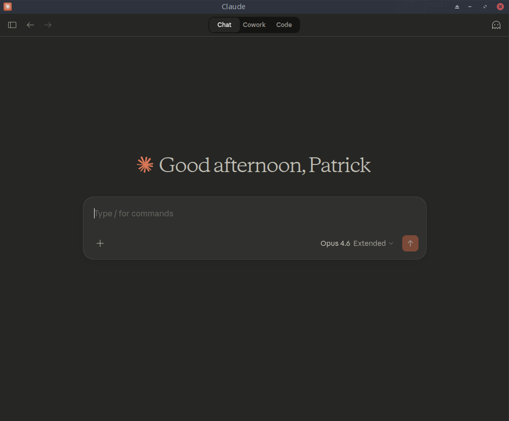

## Claude Code Integration

This package patches Claude Desktop to work with system-installed Claude Code on Linux.

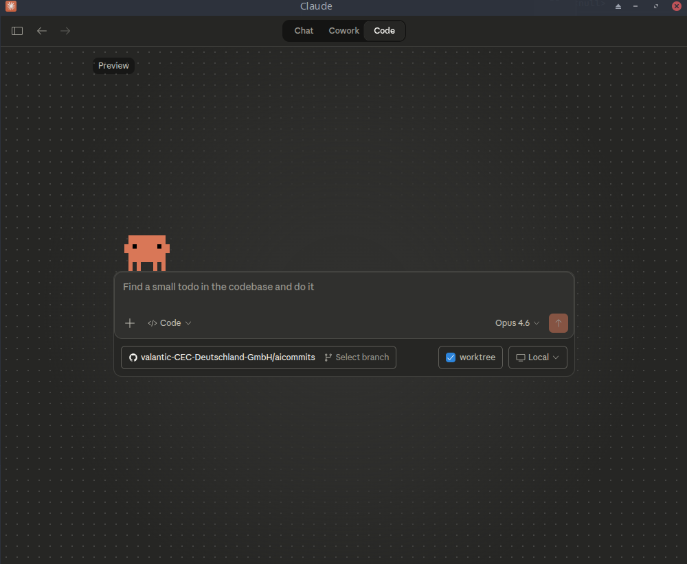

| | |
|:---:|:---:|
| 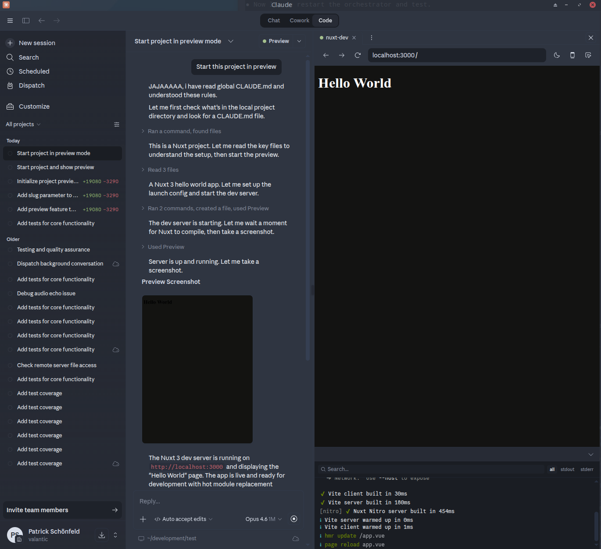 | 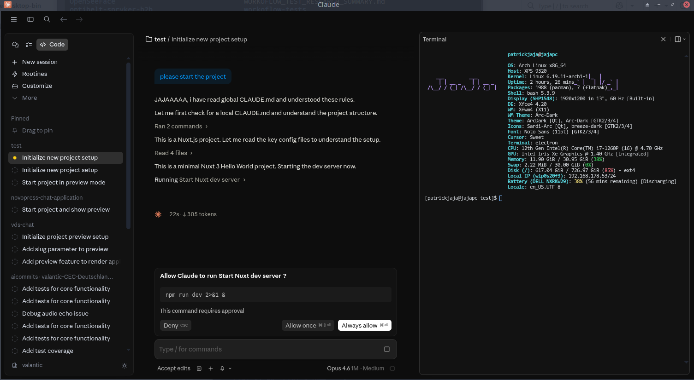 |
| Code Preview | Integrated Terminal |

To use Claude Code (and Cowork) features, install the CLI following the [official setup guide](https://code.claude.com/docs/en/setup), then verify it's accessible:
```bash
which claude  # e.g. ~/.local/bin/claude, /usr/bin/claude, /usr/local/bin/claude
```

The patch auto-detects claude in `/usr/bin`, `~/.local/bin`, and `/usr/local/bin`.

## Cowork Integration

Cowork is Claude Desktop's agentic workspace feature. It runs on the **official native Cowork VM backend** bundled inside the package (cowork-linux-helper + virtiofsd + smol-bin + QEMU/OVMF) - the same backend Anthropic ships in the official Linux build. Sessions run in a lightweight VM with `$HOME` shared in; this requires **`/dev/kvm`** on the host. There is no separate daemon to install - our repackage simply preserves the official backend.

**Setup (needed once for Cowork):** install QEMU + UEFI firmware, and make sure you can access `/dev/kvm`:

```bash
# Arch:        sudo pacman -S --needed qemu-base edk2-ovmf
# Fedora/RHEL: sudo dnf install qemu-system-x86 edk2-ovmf
# Debian/Ubuntu: sudo apt install qemu-system-x86 ovmf   # arm64: also qemu-efi-aarch64
sudo usermod -aG kvm "$USER"   # then log out and back in
```

If the workspace shows "Download failed" and clicking Download does nothing, it's almost always missing firmware (`edk2-ovmf`/`ovmf`) or missing `kvm` group membership.

> **Note — Cowork does not work inside a nested VM.** Because Cowork boots its own lightweight VM (the bundled backend downloads/builds a rootfs and starts it via QEMU/KVM), it needs real, stable access to `/dev/kvm`. Running Claude Desktop inside a hypervisor guest (VirtualBox, VMware, etc.) means Cowork would have to launch a VM *inside* a VM (nested virtualization), which most desktop hypervisors do not support reliably — VirtualBox in particular can hard-crash the entire guest when the nested VM starts. The app itself installs and runs fine in a VM; only the Cowork feature requires a bare-metal host (or a cloud instance with nested virtualization properly enabled).

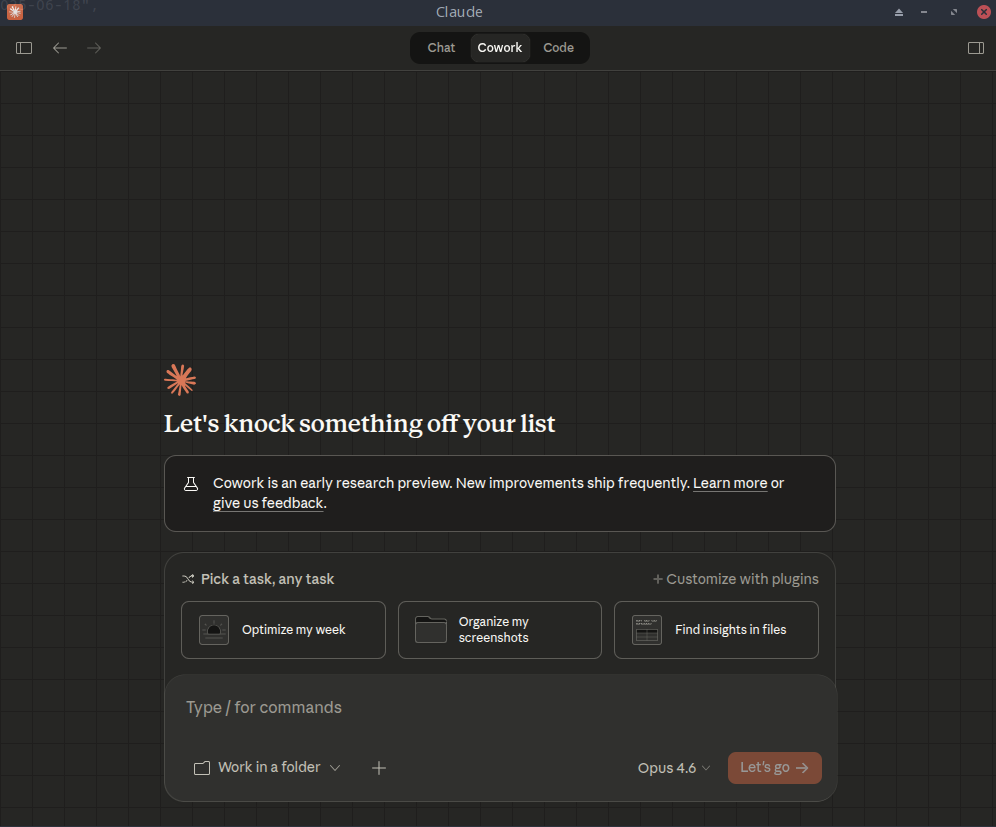

| | | | | | |
|:---:|:---:|:---:|:---:|:---:|:---:|
| 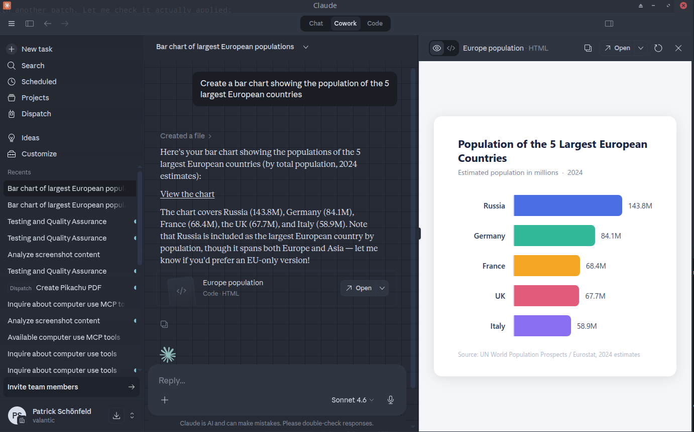 | 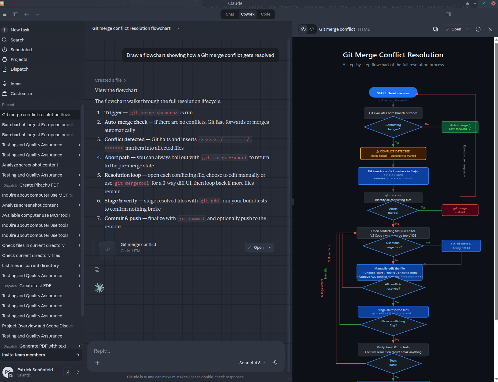 | 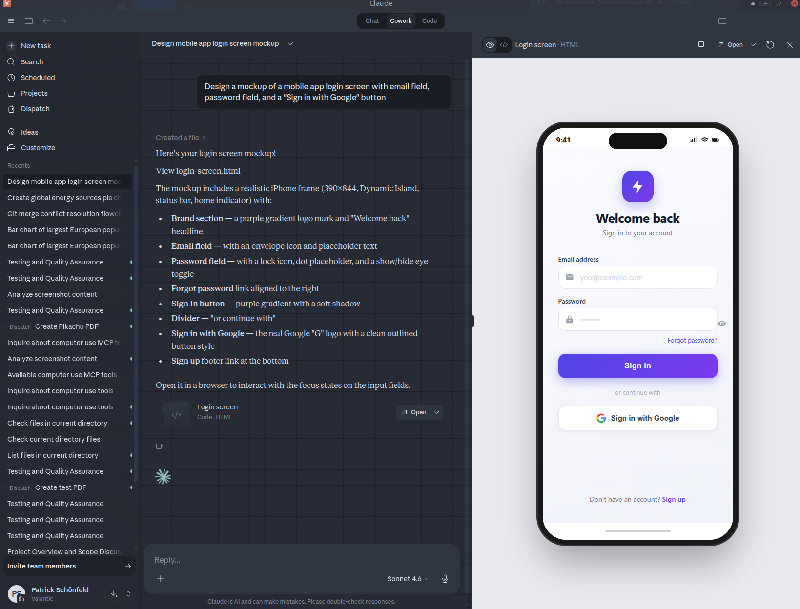 | 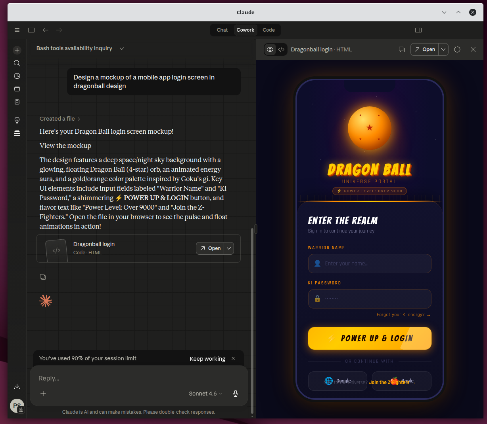 | 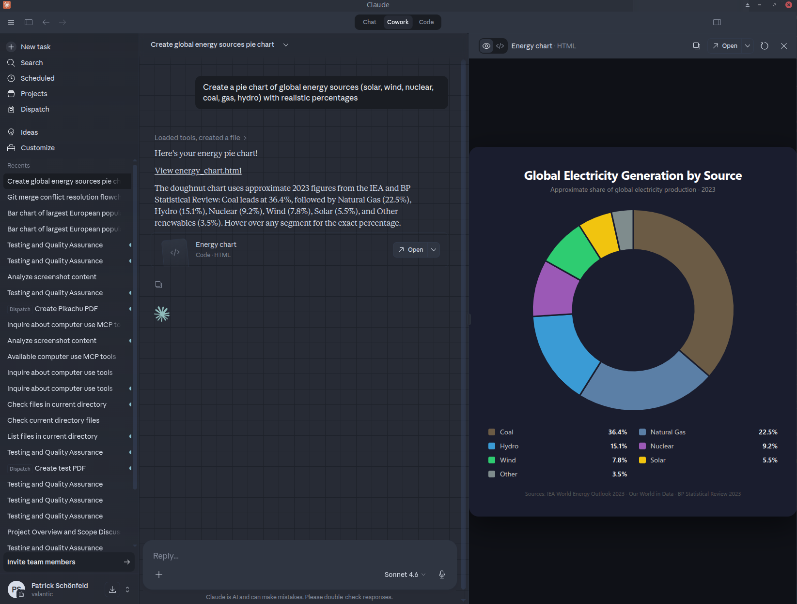 | 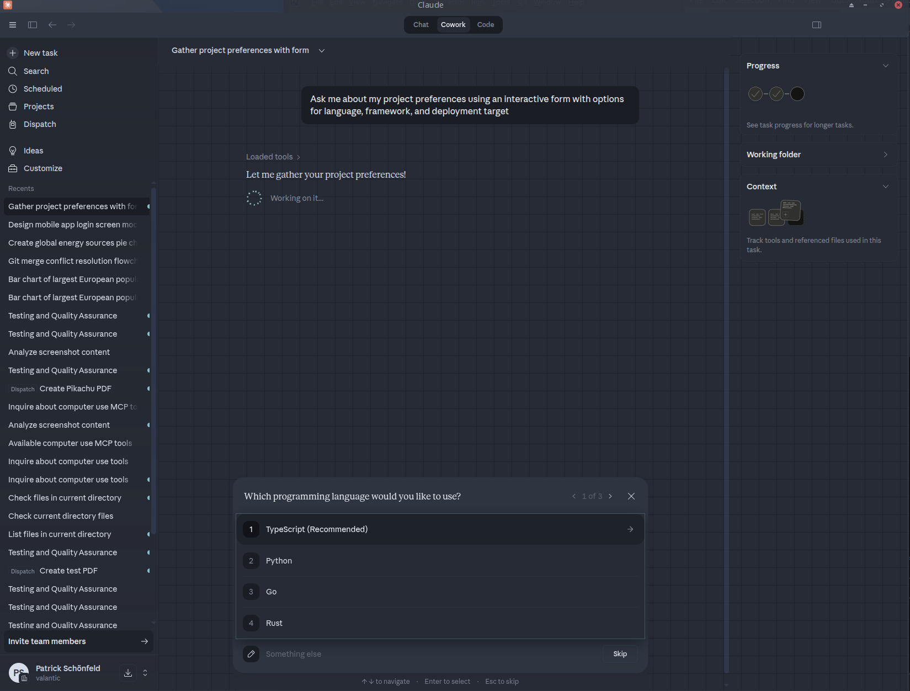 |

### Live Artifacts

Live Artifacts are persistent HTML pages stored within Cowork sessions that can pull live data from connected MCP tools (Jira, GitLab, HubSpot, Trello, etc.). They persist across sessions and can be starred for quick access.

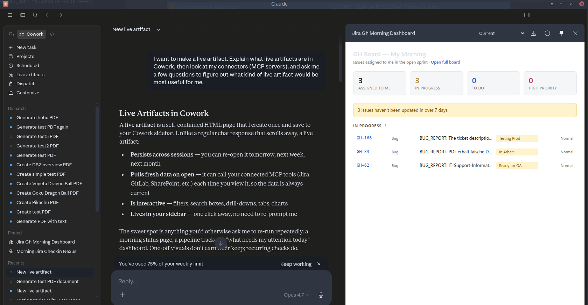

Requires Claude Code CLI (see above) and a host with `/dev/kvm` available (the bundled native Cowork VM backend uses it).

## CoworkSpaces

CoworkSpaces organizes folders, projects, and links into named Spaces for Cowork sessions. This is handled by the official build's native backend; Spaces are stored locally per account (under `~/.config/Claude/local-agent-mode-sessions/`). The Spaces UI is rendered by the claude.ai web frontend (loaded in the BrowserView).

Note: Spaces are a **local-only** store on every platform - there is no claude.ai account-sync for Spaces, so a set of Spaces created on macOS/Windows does not transfer to Linux. This is upstream behavior by design.

## Computer Use

Claude Desktop includes a built-in Computer Use MCP server with 27 tools for desktop automation - screenshot, click, type, scroll, drag, clipboard, and more. The **learn tools** (`learn_application`, `learn_screen_region`) generate interactive overlay tutorials that walk through any application's UI elements step by step.

Example prompt: *"Can you use computer use MCP to explain me the PhpStorm application?"*

| Welcome | Menu Bar | Toolbar |
|---------|----------|---------|
| 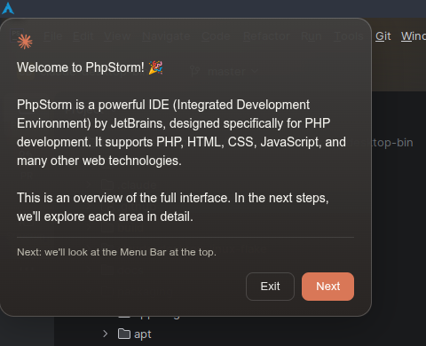 | 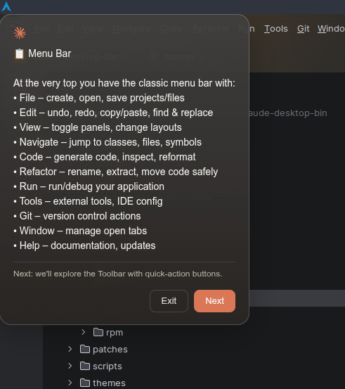 | 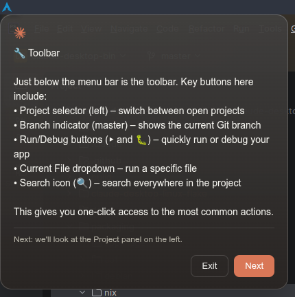 |

**How it works on Linux:** Upstream Computer Use is macOS-only - gated behind `process.platform==="darwin"` checks, macOS TCC permissions, and a native Swift executor. The patch ([fix_computer_use_linux.nim](patches/fix_computer_use_linux.nim)) removes the platform gates, routes both upstream executor factories (`createDarwinExecutor` and the Cowork/agent platform-executor factory) to it, bypasses TCC with a no-op `{granted: true}`, and injects a Linux executor that auto-detects your session type and uses the right tools. See [Optional Dependencies](#optional-dependencies) for the full package list.

**App discovery** for the teach/learn overlay scans `.desktop` files from `/usr/share/applications`, `~/.local/share/applications`, and Flatpak directories. Each app is registered with multiple name variants (full name, first word, exec basename, icon name, .desktop filename) so the model can match apps flexibly (e.g., "Thunar" matches "Thunar File Manager").

**Multi-monitor limitation:** Computer Use on Linux is limited to the **primary monitor** only. Screenshots, clicks, and the teach overlay all target the primary display. On multi-monitor setups, coordinates are translated from display-relative to absolute screen space automatically. Use `switch_display` if you need to target a different monitor for screenshots/clicks, but the teach overlay always appears on primary.

**Teach overlay on Linux:** Since Electron's `setIgnoreMouseEvents(true, {forward: true})` is [broken on X11](https://github.com/electron/electron/issues/16777), the teach overlay stays fully interactive (buttons are clickable) but blocks clicks to apps behind it during the guided tour. The tooltip repositions between steps via `anchorLogical` coordinates pointing to UI elements.

See [CLAUDE_BUILT_IN_MCP.md](baseline/CLAUDE_BUILT_IN_MCP.md#14-computer-use) for the full tool reference and [Optional Dependencies](#optional-dependencies) for required packages.

## Hardware Buddy (Nibblet)

Hardware Buddy connects Claude Desktop to a [Nibblet](https://github.com/felixrieseberg/nibblet) - a small M5StickC Plus BLE companion device that displays animated characters reflecting Claude's session state (idle, busy, celebrating, etc.).

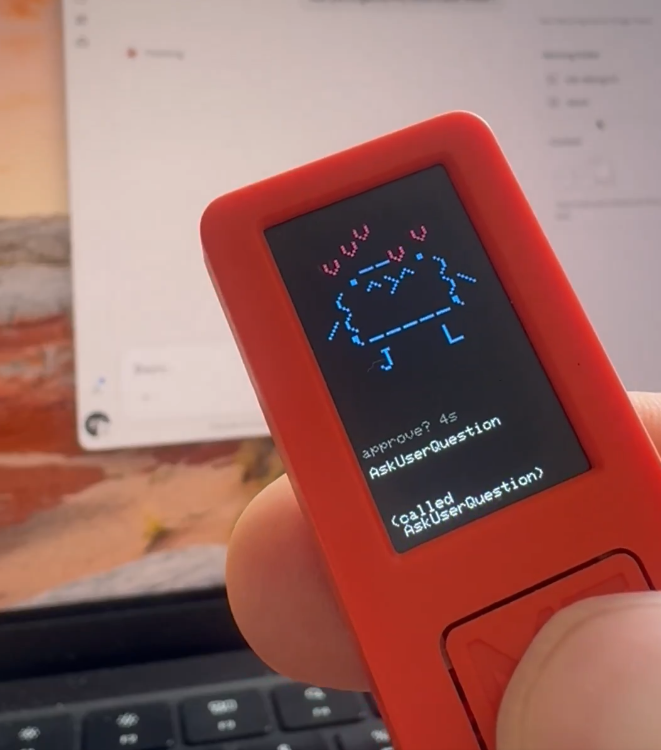

**Access:** App menu → Developer → Open Hardware Buddy…

**How it works on Linux:** The BLE communication uses standard Web Bluetooth (Nordic UART Service) via Electron's Chromium layer - no native code needed. Upstream gates the feature behind a server-side flag. The patch ([fix_buddy_ble_linux.nim](patches/fix_buddy_ble_linux.nim)) forces the flag on Linux so the BLE bridge initializes.

**Prerequisites:** `bluez` package (`sudo pacman -S bluez bluez-utils` / `sudo apt install bluez`). Bluetooth must be enabled (`bluetoothctl power on`).

**Pairing:** Power on the Nibblet - it advertises as `Nibblet-XXXX`. Click "Open Hardware Buddy…" from the Developer menu, then pair from the buddy window. The device shows session activity, token counts, and responds to permission prompts with physical button presses.

## Third-Party Inference

**Run Claude Desktop entirely on your own inference backend - no personal claude.ai login required.** Point it at **Vertex AI** (Google Cloud), **Bedrock** (AWS), **Azure AI Foundry** (Microsoft), or any **Anthropic-compatible gateway** (LiteLLM, Portkey, in-house proxies) via a single `/etc/claude-desktop/managed-settings.json`. Chat, Code, and Cowork all work in 3P mode on Linux today.

> **Migrating from `enterprise.json`?** The official Linux build reads `/etc/claude-desktop/managed-settings.json` (earlier releases of this package used `enterprise.json`). Rename the file - `sudo mv /etc/claude-desktop/enterprise.json /etc/claude-desktop/managed-settings.json` - the schema and keys (`managedMcpServers`, `inferenceProvider`, `deploymentMode`, `betaFeaturesEnabled`, …) are unchanged.

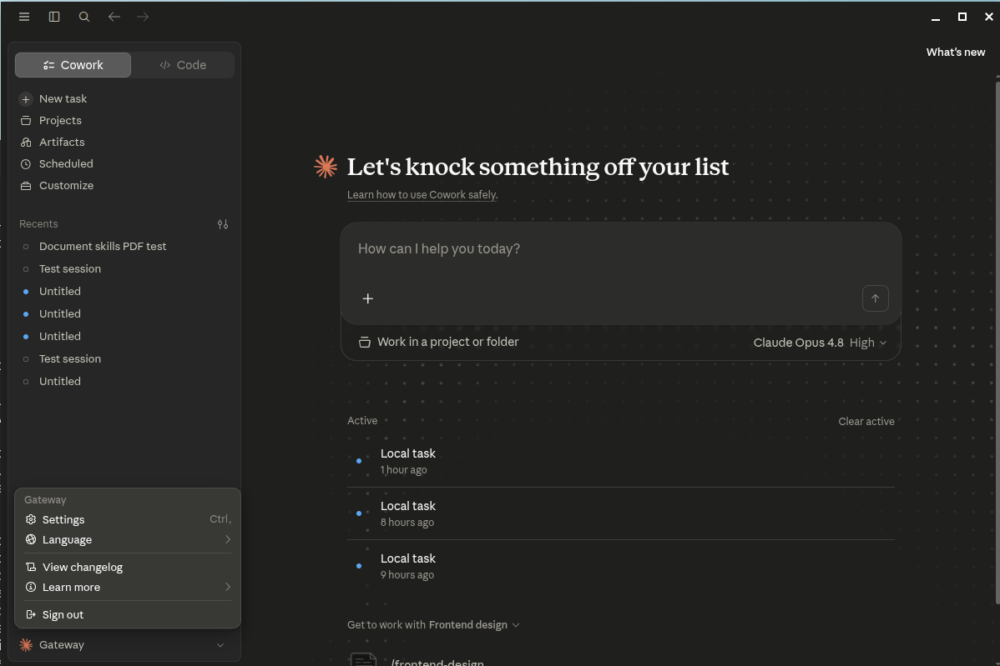

> ⚡ **Try it in 5 minutes.** Stand up a local LiteLLM proxy, drop one JSON file, and you're running Cowork against your own endpoint - see the [**LiteLLM quickstart**](docs/third-party-inference.md#5-minute-local-quickstart-litellm-container). No claude.ai account, no cloud setup.

**Enable the tabs you want.** The Chat, Cowork, and Code surfaces are managed-config toggles (all `scopes:["3p"]`): add `"betaFeaturesEnabled": true`, `"chatTabEnabled": true`, `"coworkTabEnabled": true`, and `"isClaudeCodeForDesktopEnabled": true` to your `managed-settings.json`. For a full feature-complete file - surfaces, governance, telemetry, sandbox, usage limits - see the [**maximum `managed-settings.json`**](docs/third-party-inference.md#maximum-managed-settingsjson-every-key).

The in-app configuration window (**Developer → Configure Third-Party Inference**) lets you manage connection settings, provider credentials, model lists, sandbox/workspace restrictions, MCP servers, telemetry, usage limits, and org-plugin directories - all from a single UI. Configurations export as `.mobileconfig` (macOS MDM), `.reg` (Windows GPO), or plain JSON (Linux `/etc/claude-desktop/managed-settings.json`).

**How it works on Linux:** The upstream SPA requires two patches on Linux (`fix_ion_dist_linux.nim`): a `mountPath` entry for the Linux org-plugins directory, and a platform ternary fix. Only the file manager label text was upstreamed in v1.8089.0. The main process reads enterprise config from `/etc/claude-desktop/managed-settings.json` and passes `platform: "linux"` to the frontend.

**Enterprise deployment:** Use MDM (macOS), GPO (Windows), or drop a JSON file at `/etc/claude-desktop/managed-settings.json` (Linux) to manage fleet-wide configuration.

**Switching back to personal (1P) login:** deployment mode is **sticky** - the first 3P launch persists `"deploymentMode": "3p"` to `~/.config/Claude-3p/claude_desktop_config.json`, so simply deleting `managed-settings.json` leaves the app stuck in (now credential-less) 3P mode. Launch once with the upstream flag `claude-desktop --boot-1p-once`, or set that key to `"1p"` for a permanent switch. See [docs/third-party-inference.md → Common gotchas](docs/third-party-inference.md#common-gotchas).

**Linux setup walkthrough:** The official 3P docs only cover macOS and Windows. See [docs/third-party-inference.md](docs/third-party-inference.md) for a Linux-specific guide - the in-app wizard route (requires Developer Mode), a headless `managed-settings.json` route with worked **Vertex AI** (`gcloud` ADC) and **LiteLLM gateway** examples, and how to verify it via `main.log`.

**`managed-settings.json` key reference (official Anthropic docs):**

- [Configuration reference](https://claude.com/docs/cowork/3p/configuration) - the full key reference (`inferenceProvider`, `inferenceModels` + `anthropicFamilyTier`, gateway/Bedrock/Vertex/Foundry keys, credential helpers, sandbox & security profiles).
- [Enterprise configuration for Claude Desktop](https://support.claude.com/en/articles/12622667-enterprise-configuration-for-claude-desktop) - managed-preferences overview for fleet rollouts.
- [Extend Claude Cowork with third-party platforms](https://support.claude.com/en/articles/14680753-extend-claude-cowork-with-third-party-platforms) - **note:** on 3P (Bedrock/Vertex/Azure/gateway), MCP connectors, plugins, and skills work differently than on Claude Enterprise. Cowork skills come from a local store rather than your claude.ai org, so document skills (`/pdf`, `/docx`, …) must be installed locally.

## Custom Themes

Recolor the whole app - chat, sidebar, Code/Cowork, dialogs, Quick Entry - by overriding CSS variables, injected into every window via Electron's `insertCSS()`. Each theme is **dual light/dark**: it ships a `light` and a `dark` palette, and the app's own toggle (Settings -> Appearance) picks the matching one live. Every built-in is contrast-checked (WCAG AA).

**Quick start** - just pick a theme, no extra config needed:
```bash
echo '{"activeTheme": "mario"}' > ~/.config/Claude/claude-desktop-bin.json
# Restart Claude Desktop, then toggle Settings -> Appearance for light/dark
```

### New: Mario theme

A full Nintendo-flavored theme with a **light "overworld"** and a **dark "underground"** variant - and the loading starburst is replaced with a bouncing **mushroom** spinner.

| Light (overworld) | Dark (underground) |
|-------------------|--------------------|
| 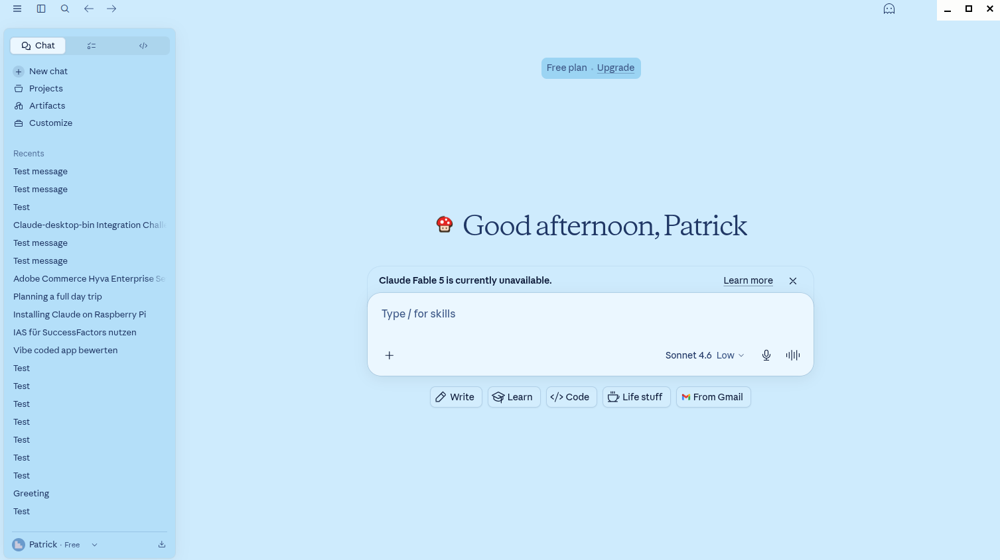 | 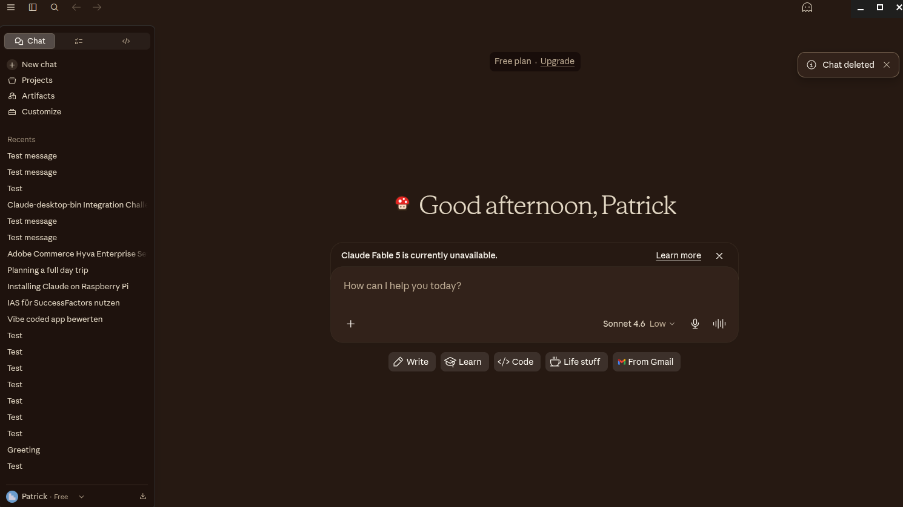 |

### Built-in themes

| Theme | Light variant | Dark variant | Spinner |
|-------|---------------|--------------|---------|
| `mario` | sky-blue overworld | warm-brick underground | mushroom |
| `sweet` | blush/lavender | deep purple, vivid pink ([Sweet](https://github.com/EliverLara/Sweet)) | blossom |
| `nord` (alias `nordic`) | Snow Storm | Polar Night ([nordtheme.com](https://nordtheme.com)) | snowflake |
| `catppuccin-mocha` | Latte | Mocha ([catppuccin.com](https://catppuccin.com)) | cat |
| `catppuccin-macchiato` | Latte | Macchiato | cat |
| `catppuccin-frappe` | Latte | Frappe | cat |
| `catppuccin-latte` | Latte | Mocha | coffee cup |

Each theme can also replace the loading glyph with a custom SVG (the `spinner` field), and inject raw `customCss`. See **[themes/README.md](themes/README.md)** for the full guide: schema, CSS variable reference, contrast tips, and how to author your own theme.

## Patches

The package applies several patches to make Claude Desktop work on Linux. Each patch is isolated in `patches/` for easy maintenance:

| Patch | Purpose | Debug pattern |
|-------|---------|---------------|
| `add_feature_custom_themes.nim` | CSS theme injection - 7 dual light/dark themes (mario, sweet, nord, catppuccin-*) + per-theme spinner reshape | Prepended IIFE, no regex |
| `enable_local_agent_mode.nim` | Forces Local Agent Mode / Code / plugin feature flags on and spoofs the client-OS platform header. Does not force-mark the Cowork VM features (`yukonSilver`/`coworkKappa`/…) - those now reflect the native VM-capability probe | `rg -o 'status:"supported".{0,40}' index.js`; `rg -o 'anthropic-client-os-platform.{0,40}' index.js` |
| `fix_0_node_host.nim` | Fixes 4 sidecar runtime paths (MCP nodeHost, directMcpHost, shell-path-worker, transcript-search-worker) that join `process.resourcesPath+"app.asar"`; without this `fix_locale_paths` corrupts them into `resources/locales/app.asar/...` (remote MCP fails with ERR_MODULE_NOT_FOUND, issue #140) | `rg -o 'process\.resourcesPath,"app.asar"' index.js` |
| `fix_app_quit.nim` | Uses `app.exit(0)` to prevent hang on exit | `rg -o '.{0,50}app\.quit.{0,50}' index.js` |
| `fix_asar_folder_drop.nim` | Prevents app.asar from being misdetected as a folder drop on launch ([#24](https://github.com/patrickjaja/claude-desktop-bin/issues/24)) | `rg -o 'filter.*\.asar' index.js` |
| `fix_asar_workspace_cwd.nim` | Redirects app.asar workspace paths to home directory ([#24](https://github.com/patrickjaja/claude-desktop-bin/issues/24)) | `rg -o '__cdb_sanitizeCwd' index.js` |
| `fix_browse_files_linux.nim` | Enables `openDirectory` in file dialog (upstream macOS-only) | `rg -o 'openDirectory.{0,60}' index.js` |
| `fix_browser_tools_linux.nim` | Enables Chrome browser tools - redirects native host to Claude Code's wrapper | `rg -o '"Helpers".{0,50}' index.js` |
| `fix_builtin_mcp_browser_env.nim` | Forwards DISPLAY/Wayland/XDG/DBUS/BROWSER env to built-in MCP servers so OAuth (e.g. the M365 connector) can open a browser on Linux ([#139](https://github.com/patrickjaja/claude-desktop-bin/issues/139)) | `rg -o '"HOME","LOGNAME","PATH","SHELL","TERM","USER".{0,40}' index.js` |
| `fix_buddy_ble_linux.nim` | Enables Hardware Buddy (Nibblet BLE device) - forces feature flag, uses Web Bluetooth via BlueZ | `rg -o '2358734848.{0,50}' index.js` |
| `fix_claude_code.nim` | Detects system-installed Claude Code binary | `rg -o 'async getStatus\(\)\{.{0,200}' index.js` |
| `fix_cli_governor_memavailable.nim` | Computes CliGovernor memory pressure from `MemAvailable`/`MemTotal` (`/proc/meminfo`) instead of Electron's `free` (= Linux `MemFree`, which excludes reclaimable page cache) - stops false `[CliGovernor] memory pressure` warnings on healthy systems; falls back to the upstream metric if the `/proc` read fails ([#128](https://github.com/patrickjaja/claude-desktop-bin/issues/128)) | `rg -o 'getFreeMemoryRatio.{0,160}' index.js` |
| `fix_computer_use_linux.nim` | Enables Computer Use - removes platform gates, routes both executor factories to an injected Linux executor (portal+PipeWire/grim/GNOME D-Bus/spectacle/scrot, xdotool/ydotool) | `rg -o '.{0,60}executor not implemented' index.js` |
| `fix_computer_use_tcc.nim` | Stubs macOS TCC permission handlers to prevent error logs | Prepended IIFE, UUID extraction |
| `fix_cowork_font.nim` | Applies the user's chat font preference to the Cowork tab on load (avoids default Serif) | Prepended dom-ready IIFE, no regex |
| `fix_cowork_firmware_paths_linux.nim` | Adds Fedora/RHEL + Arch OVMF firmware paths (and Arch's `/usr/lib/virtiofsd`) to the native Cowork VM capability probe, which otherwise only searches the Debian paths - fixes "Download failed" / inert Download button on non-Debian distros | `rg -o 'OVMF_CODE.{0,80}' index.js` |
| `fix_cross_device_rename.nim` | EXDEV fallback for cross-filesystem file moves | Uses `.rename(` literal |
| `fix_detected_projects_linux.nim` | Enables detected projects with Linux IDE paths (VSCode, Cursor, Zed) | `rg -o 'detectedProjects.{0,50}' index.js` |
| `fix_disable_autoupdate.nim` | Disables auto-updater (no Linux installer) | `rg -o '.{0,40}isInstalled.{0,40}' index.js` |
| `fix_dispatch_linux.nim` | Enables Dispatch - forces bridge init, bypasses platform gate, forwards responses natively | `rg -o 'sessions-bridge.*init' index.js` |
| `fix_dock_bounce.nim` | Suppresses taskbar attention-stealing on KDE/Wayland | Prepended IIFE, no regex |
| `fix_enterprise_config_linux.nim` | Regression guard: the official build reads managed config natively from `/etc/claude-desktop/managed-settings.json` (top-level key `managedMcpServers`); this patch asserts that native reader is present and fails the build loudly if it disappears | `rg -o '/etc/claude-desktop.{0,40}managed-settings' index.js` |
| `fix_enterprise_config_linux_pre.nim` | Regression guard for the early bootstrap bundle (`index.pre.js`): asserts the native managed-config reader is present there too (the bootstrap decides the `-3p` userData split) and fails loudly if it disappears | `rg -o '/etc/claude-desktop.{0,40}managed-settings' index.pre.js` |
| `fix_imagine_linux.nim` | Enables Imagine/Visualize - forces GrowthBook flag for inline SVG/HTML rendering | `rg -o '3444158716' index.js` |
| `fix_ion_dist_linux.nim` | Adds Linux org-plugins mount path + platform ternary to ion-dist 3P config SPA | `rg -o 'mountPath.{0,80}' ion-dist/assets/v1/*.js` |
| `fix_locale_paths.nim` | Redirects locale file paths to Linux install location | Global string replace on `process.resourcesPath` |
| `fix_locale_paths_pre.nim` | Companion for the early bootstrap bundle (`index.pre.js`): redirects `process.resourcesPath` if the bootstrap reintroduces one, else positively asserts the bootstrap references none (no silent no-op) | `rg -o 'process\.resourcesPath.{0,40}' index.pre.js` |
| `fix_marketplace_linux.nim` | Forces host-local mode for plugin operations (no VM); promotes `$HOME`-scoped CLI plugins to user scope so they appear under "Personal Plugins" | `rg -o 'function \w+\(\w+\)\{return\(\w+==null.*mode.*ccd' index.js` |
| `fix_native_frame.nim` | Default: Windows-style integrated titlebar on Linux. Opt-out via `CLAUDE_NATIVE_TITLEBAR=1` or `--native-titlebar` to restore the native GTK frame. Preserves Quick Entry. | `rg -o 'titleBarStyle:process\.platform.{0,80}' index.js` |
| `fix_native_frame_renderer.nim` | Renderer companion to `fix_native_frame`. As of v1.13576 the fix is upstreamed (the main-window title-bar component returns `null` natively), so this patch is now a regression guard: it asserts the upstream `null` short-circuit still exists and fails the build loudly if a future release reintroduces the pointer-absorbing drag region. | `rg -o '\{isMainWindow:\w+,.{0,80}return null' MainWindowPage-*.js` |
| `fix_open_in_editor_linux.nim` | Makes "Open in VS Code / Cursor / Zed / Windsurf" work in Local Code Sessions on Linux by replacing the macOS/Windows-only `getApplicationInfoForProtocol` calls with an `xdg`-based shim | `rg -o 'getApplicationInfoForProtocol.{0,40}' index.js` |
| `fix_process_argv_renderer.nim` | Injects `process.argv=[]` in renderer preload to prevent TypeError | `rg -o '.{0,30}\.argv.{0,30}' mainView.js` |
| `fix_profile_url_routing.nim` | Hooks `shell.openExternal` to write a per-profile auth-marker file before opening SSO URLs, so the system `claude://` handler can route callbacks to the right profile | `rg -o 'shell\.openExternal' index.js` |
| `fix_profile_window_title.nim` | Appends profile name to window title (`Claude` → `Claude (work)`) for named profiles | Prepended IIFE, `page-title-updated` listener |
| `fix_quick_entry_app_id.nim` | Gives Quick Entry a distinct Wayland `app_id` so shell-extension users can blacklist it independently ([#39](https://github.com/patrickjaja/claude-desktop-bin/issues/39)); resets to per-profile `app_id` after Quick Entry closes | `rg -o '.{0,30}BrowserWindow.*titleBarStyle.*hidden.{0,30}' index.js` |
| `fix_quick_entry_cli_toggle.nim` | Enables `claude-desktop --toggle` Quick Entry hotkey (~5-25 ms via Unix socket); per-profile socket path | `rg -o 'QUICK_ENTRY.{0,80}' index.js` |
| `fix_quick_entry_position.nim` | Quick Entry opens on cursor's monitor (multi-monitor); position+focus retries gated to X11 only (Wayland: no jitter) | `rg -o 'getPrimaryDisplay.{0,50}' index.js` |
| `fix_quick_entry_ready_wayland.nim` | Adds 100ms timeout to Quick Entry ready-to-show wait (Wayland hang fix; `ready-to-show` never fires for frameless transparent windows) | `rg -o 'ready-to-show.{0,50}' index.js` |
| `fix_quick_entry_wayland_blur_guard.nim` | Guards Quick Entry blur-to-dismiss against spurious Wayland blur events | `rg -o '.{0,30}blur.{0,30}null.{0,30}' index.js` |
| ~~`fix_read_terminal_linux.py`~~ | **Removed in v1.2.234** - upstream now natively supports Linux | N/A |
| `fix_renderer_gone_suppressed_log.nim` | Logs main-webview renderer deaths that upstream silently swallows (expected kills, `killed`/`clean-exit` reasons - a kernel OOM SIGKILL maps to `killed`, so OOM-killed renderers left no trace in main.log) ([#128](https://github.com/patrickjaja/claude-desktop-bin/issues/128)) | `rg -o 'render process gone \(suppressed\).{0,60}' index.js` |
| `fix_sensitive_dirs_linux.nim` | Adds Linux entries (`.local/share/keyrings`, `.pki`, `.config/autostart`) to the sandbox sensitive-directories block list | `rg -o '\.gnupg.{0,80}' index.js` |
| `fix_startup_settings.nim` | The official build now manages the XDG autostart `.desktop` entry natively for the "Start at login" toggle; the read/write paths are kept as regression guards asserting that native behavior, plus per-profile autostart-file handling for named profiles | `rg -o 'isStartupOnLoginEnabled.{0,50}' index.js` |
| `fix_terminal_shell_linux.nim` | Regression guard: the official build's agent/Cowork terminal natively resolves a POSIX login shell (`$SHELL` → … → `/bin/sh`) instead of the old hardcoded `powershell.exe` ([#143](https://github.com/patrickjaja/claude-desktop-bin/issues/143)); this patch asserts that native resolver is present and fails the build loudly if it regresses to a fixed shell | `rg -o 'shell:\w+\(\).{0,40}' index.js` |
| `fix_tray_dbus.nim` | Prevents DBus race conditions with mutex and cleanup delay | `rg -o 'menuBarEnabled.*function' index.js` |
| `fix_tray_icon_theme.nim` | Theme-aware tray icon (light/dark) | `rg -o 'nativeTheme.{0,50}tray' index.js` |
| ~~`fix_tray_path.py`~~ | **Removed** - tray icon paths handled by `fix_locale_paths.nim` | N/A |
| `fix_updater_state_linux.nim` | Adds version fields to idle updater state to prevent TypeError | `rg -o 'status:"idle".{0,50}' index.js` |
| `fix_utility_process_kill.nim` | SIGKILL fallback when UtilityProcess doesn't exit gracefully | `rg -o 'Killing utiltiy proccess' index.js` |
| `fix_window_bounds.nim` | Fixes BrowserView bounds on maximize/snap, Quick Entry blur | Injected IIFE, minimal regex |

When Claude Desktop updates break a patch, only the specific patch file needs updating. The **debug pattern** column shows the `rg` command to find the relevant code in the new version's `index.js`.

## Automation
This repository automatically:
- Checks for new Claude Desktop versions daily
- **Validates all patches in Docker** before pushing to AUR
- Updates the AUR package when new versions are detected
- Creates GitHub releases for tracking updates
- Maintains proper SHA256 checksums

### Patch Validation

The CI pipeline includes a test build step that validates patches before updating AUR:

1. **Docker Test Build** - Runs `makepkg` in an `archlinux:base-devel` container
2. **Pattern Matching Validation** - Each patch exits with code 1 if patterns don't match
3. **Pipeline Stops on Failure** - Broken packages never reach AUR users
4. **Build Logs Uploaded** - Artifacts available for debugging failures

If upstream Claude Desktop changes break a patch:
- The pipeline fails with clear `[FAIL]` output
- Build logs show which pattern didn't match
- AUR package remains unchanged until patches are updated

## Repository Structure
- `.github/workflows/` - GitHub Actions for automation
- `scripts/` - Build and validation scripts
- `patches/` - Linux compatibility patches
- `packaging/` - Debian, RPM, AppImage, and Nix build scripts
- `PKGBUILD.template` - AUR package template

## Multiple Profiles

Run several Claude Desktop instances side by side, each logged in to a different account, with fully isolated state for both Desktop and the Claude Code CLI it spawns. Useful for separating work from personal accounts, juggling multiple SSO tenants, or testing config changes without affecting your main install.

### Quick start

```bash
# One-time setup per profile
claude-desktop --create-profile=work
claude-desktop --create-profile=personal

# Launch (any of these work)
claude-desktop-work                     # via the per-profile shortcut
claude-desktop --profile=work           # via the system launcher
# …or click "Claude (work)" in your application menu

# Inspect / clean up
claude-desktop --list-profiles
claude-desktop --delete-profile=work    # removes entry points; user data preserved
```

### The default (unnamed) profile

If you don't pass `--profile=` and don't launch through a named-profile shortcut, you get the **default profile**. This is byte-identical to a single-instance install - same `~/.config/Claude`, same `~/.claude`, same sockets, same WM identity. Nothing changes for users who never touch profiles. There's no `--create-profile=default` step, and it's always available implicitly.

You can run the default profile alongside any number of named profiles. The default profile is just "the profile with no suffix."

### Named profiles

A named profile is created with `--create-profile=NAME`. Names must match `[a-zA-Z0-9_-]+` and the literal `default` is reserved.

`--create-profile` installs three things in your home directory (no root needed):

| Path | Purpose |
|---|---|
| `~/.local/lib/claude-desktop/claude-NAME` | Per-profile Electron binary (real file - see [Why a copy?](#why-a-copy-of-the-binary) below). Sibling files in the same directory are symlinks back to the system install. |
| `~/.local/bin/claude-desktop-NAME` | Convenience launcher - symlink to the system launcher. Pulls profile name from its own basename. |
| `~/.local/share/applications/claude-NAME.desktop` | Application-menu entry titled `Claude (NAME)`. `Exec=` is absolute so it works regardless of `$PATH`. |

User data is **not** created until first launch - that way `--create-profile` is cheap and reversible.

### Selecting a profile at launch

Three equivalent ways:

1. `claude-desktop --profile=NAME [args…]` - explicit flag.
2. `CLAUDE_PROFILE=NAME claude-desktop [args…]` - env var, useful for scripts.
3. `claude-desktop-NAME [args…]` - invocation via the per-profile shortcut. The launcher infers `NAME` from its own basename.

All three set the same `CLAUDE_PROFILE` env var, which propagates through Electron, the cowork hooks, and any spawned `claude` (Code CLI) child processes.

Subcommands honor the active profile: `claude-desktop-work --toggle` toggles work's Quick Entry, `claude-desktop --profile=work --diagnose` reports work's paths.

### What's isolated

| Resource | Default profile | Named profile (e.g. `work`) |
|---|---|---|
| Electron userData (login, logs, settings, custom themes, Cowork sessions/Spaces, PipeWire portal token) | `~/.config/Claude` | `~/.config/Claude-work` |
| Claude Code config (settings, projects, sessions, plugins) | `~/.claude` | `~/.claude-work` |
| Quick Entry toggle socket | `$XDG_RUNTIME_DIR/claude-desktop-qe.sock` | `…/claude-desktop-qe-work.sock` |
| systemd user scope (cgroup, portal identity) | `app-claude-PID.scope` | `app-claude-work-PID.scope` |
| WM_CLASS / Wayland app_id (taskbar grouping, Alt-Tab) | `claude` | `claude-work` |
| XDG autostart entry ("Start at login") | `~/.config/autostart/claude.desktop` | `…/claude-work.desktop` |

Cowork runs on the official native VM backend bundled in the package. Per-profile isolation comes from the spawned `claude` CLI inheriting `CLAUDE_CONFIG_DIR=~/.claude-NAME` and using the per-profile `--plugin-dir` (which derives from Electron's `app.getPath("userData")`), so each profile's sessions stay separate.

Plugins, MCP servers, login state, and chat history from one profile are **not** visible in another. This is by design - profiles are independent installs, not views into shared state.

### Removing a profile

```bash
claude-desktop --delete-profile=work
```

Removes the three entry points listed above. **User data is preserved** at `~/.config/Claude-work` and `~/.claude-work`. Delete those manually if you really want a clean slate:

```bash
rm -rf ~/.config/Claude-work ~/.claude-work
```

### SSO and URL routing

The `claude://` URL scheme is registered system-wide and points to the default profile's `.desktop` file. Without extra work, an SSO callback initiated from a named profile would launch the default profile and consume the auth token there, breaking login. claude-desktop-bin uses a small two-part routing mechanism to fix this:

1. **Marker on browser open.** When a profile-active instance calls `shell.openExternal()` on an auth-ish URL (matches `oauth`, `sso`, `auth`, `login`, `signin`, `callback`, or `accounts`), it writes a marker file at `$XDG_RUNTIME_DIR/claude-desktop-pending-auth-<profile>` containing the current timestamp. Implementation: [`patches/fix_profile_url_routing.nim`](patches/fix_profile_url_routing.nim).
2. **Marker dispatch on callback.** When the launcher is invoked with a `claude://` URL and no explicit profile, it picks the most recent marker (less than 5 minutes old) and re-execs as that profile. Electron's `second-instance` event delivers the URL to the running profile window.

You can log in to multiple profiles in any order, including multiple SSO logins, with one narrow caveat:

| Scenario | Result |
|---|---|
| Single profile (any kind) | ✅ |
| Default + named, log in to either first, in any order | ✅ |
| Multiple named profiles, SSO into each one sequentially | ✅ |
| Profile crashes mid-auth | ✅ Marker self-heals via 5-minute TTL |
| SSO into profile A, click an unrelated outbound link, then complete the SSO flow | ⚠️ The link click overwrites the marker; the callback may misroute. Re-attempt SSO. |
| Two SSO flows in flight concurrently (browser tabs open in parallel for different profiles) | ⚠️ "Most recent marker wins"; the loser's callback lands in the winner's profile. Re-attempt for the loser. |

The marker is `0600`-permissioned and contains only a timestamp; nothing about the URL or session is persisted. To inspect what the launcher saw at routing time, run `claude-desktop --diagnose` while a marker is fresh.

If routing misbehaves, the escape hatch is to launch the URL explicitly:

```bash
claude-desktop --profile=NAME 'claude://<callback-url>'
```

#### Opening shared-artifact links

When you share a live Cowork artifact, the **Share** dialog gives you a `claude://cowork/shared-artifact?uuid=...` link. Clicking it as a real hyperlink opens Claude Desktop. Pasting it into a browser's address bar will *not* work - the omnibox treats unknown schemes as a search query (an intentional browser security gate). To open a copied link, run it through `xdg-open` instead:

```bash
xdg-open 'claude://cowork/shared-artifact?uuid=019ed5e5-0b48-70c0-acf7-0de07c244c97'
```

### Limitations

- **~200 MB disk per profile on cross-filesystem installs.** See [Why a copy?](#why-a-copy-of-the-binary) below.
- **Auto-refresh after package upgrades.** Hardlinks and reflinks snapshot the binary at creation; an upgrade replaces `/usr/lib/claude-desktop-bin/claude` with a new file while the per-profile copy keeps pointing at the old version. The launcher detects this on every named-profile launch (canonical newer than per-profile, or per-profile non-executable on NixOS where store paths move, or any sibling symlink dangling) and re-materialises the binary plus refreshes the symlink mirror automatically. You'll see `claude-desktop: refreshing stale per-profile binary (...)` on stderr when this fires. To force-refresh manually:
  ```bash
  for p in $(claude-desktop --list-profiles | awk 'NR>1 {print $1}'); do
      claude-desktop --delete-profile="$p"
      claude-desktop --create-profile="$p"
  done
  ```
- **MCP servers and plugins do not cross profiles.** If you need the same MCP setup in two profiles, configure each independently.
- **Concurrent SSO race** as noted in the table above. Sequential SSO is reliable.
- **Quick Entry GNOME hotkey is global, not per-profile.** `claude-desktop --install-gnome-hotkey` writes a single keybinding bound to `claude-desktop --toggle`, which targets the **default** profile's Quick Entry socket. Per-profile hotkeys would need separate accelerators and bindings - install them by hand if needed: `gsettings`-write a custom-keybinding slot whose `command` is `claude-desktop --profile=NAME --toggle`. The launcher's `--toggle` does honor the active profile when invoked with `--profile=NAME`.
- **`--profile=NAME` without `--create-profile`** isolates state but not WM identity (the window joins the default profile's taskbar entry). The launcher prints a one-line hint pointing at `--create-profile`; suppress with `CLAUDE_PROFILE_QUIET=1`.
- **Wayland portal identity caveats on NixOS** (already true single-instance) carry over to named profiles too.

### Why a copy of the binary?

Electron derives its WM_CLASS (X11) and Wayland `app_id` from the basename of `/proc/self/exe`, which the kernel always resolves through symlinks. A symlink at `~/.local/lib/claude-desktop/claude-work` pointing to `/usr/lib/claude-desktop-bin/claude` would still report the system path as the exe - and the WM would group all profile windows as one app. That's how Chrome itself handles channels: `google-chrome-stable` and `google-chrome-beta` are separate copies, not symlinks.

To get distinct app identity per profile, `--create-profile` materialises a real, independently-named binary file. It tries (in order):

1. **Hardlink** (`ln`) - zero disk cost, only works on the same filesystem.
2. **Reflink** (`cp --reflink=always`) - zero disk cost via copy-on-write, only on btrfs/xfs.
3. **Plain copy** (`cp`) - ~200 MB per profile, fallback.

The `Created profile` output tells you which path was taken. Sibling files in the same directory (`libffmpeg.so`, `.pak`, `locales/`, `resources/`, `version`, etc.) are always symlinks back to the system install - Electron's `RPATH=$ORIGIN` and Chromium's resource loader expect them next to the binary, but they don't need to be per-profile. Sibling symlinks are shared across all profiles in `~/.local/lib/claude-desktop/`.

## Environment Variables

| Variable | Values | Description |
|----------|--------|-------------|
| `CLAUDE_PROFILE` | name | Select a profile by name (alternative to `--profile=` or the per-profile symlink). Inherited by Electron and Claude Code so per-profile sockets and config dirs are picked up everywhere |
| `CLAUDE_PROFILE_QUIET` | `1` | Suppress the "no per-profile WM identity" hint that fires when `CLAUDE_PROFILE` is set without a matching `--create-profile` |
| `CLAUDE_CONFIG_DIR` | path | Override Claude Code's config dir. Auto-set by the launcher when `CLAUDE_PROFILE` is active; honored by `@anthropic-ai/claude-code` |
| `CLAUDE_DISABLE_GPU` | `1`, `full` | Fix white screen on some GPU/driver combos ([#13](https://github.com/patrickjaja/claude-desktop-bin/issues/13)). `1` disables compositing only, `full` disables GPU entirely |
| `CLAUDE_USE_XWAYLAND` | `1` | Force XWayland instead of native Wayland |
| `CLAUDE_ENABLE_VULKAN` | `1` | Keep Vulkan enabled on native Wayland. Default off: on Wayland the launcher passes `--disable-features=Vulkan` because on real GPUs Chromium (Electron 42) brings up Vulkan, which it refuses to pair with `--ozone-platform=wayland` - causing a silent no-window startup. Harmless no-op where Vulkan wasn't selected (VMs, software GL). Only affects Wayland; X11/XWayland always keep Vulkan |
| `CLAUDE_MENU_BAR` | `auto`, `visible`, `hidden` | Menu bar visibility (default: `auto`, toggle with Alt) |
| `CLAUDE_DEV_TOOLS` | `detach` | Open Chromium DevTools on launch |
| `CLAUDE_ELECTRON` | path | Override Electron binary path |
| `CLAUDE_APP_ASAR` | path | Override app.asar path |
| `CLAUDE_NATIVE_TITLEBAR` | `1` | Restore the native window frame (default: integrated titlebar with overlay, matching Windows/macOS). Equivalent to `--native-titlebar`. See [#100](https://github.com/patrickjaja/claude-desktop-bin/pull/100) |
| `CLAUDE_DISABLE_SYSTEMD_SCOPE` | `1` | Skip the `systemd-run --user --scope` wrapper. Use in sandboxes (bwrap, distrobox, ...) where the systemd private socket is unreachable. Equivalent to the `--no-systemd-scope` CLI flag. See [#89](https://github.com/patrickjaja/claude-desktop-bin/issues/89) |
| `ELECTRON_ENABLE_LOGGING` | `1` | Log Electron main process to stderr |

Set permanently in `~/.bashrc` or `~/.zshrc`, or pass per-launch: `CLAUDE_DISABLE_GPU=1 claude-desktop`

## Debugging

Runtime logs are written to `~/.config/Claude/logs/`:
| Log File | Description |
|----------|-------------|
| `main.log` | Main Electron process |
| `claude.ai-web.log` | BrowserView web content |
| `mcp.log` | MCP server communication |

```bash
# Tail logs in real-time
tail -f ~/.config/Claude/logs/main.log

# Search for errors across all logs
grep -ri 'error\|exception\|fatal' ~/.config/Claude/logs/

# Launch with DevTools + full logging
CLAUDE_DEV_TOOLS=detach ELECTRON_ENABLE_LOGGING=1 claude-desktop 2>&1 | tee /tmp/claude-debug.log
```

## Dispatch Architecture

Dispatch lets you send tasks from the Claude mobile app to your Linux desktop. It's fully native - no VM, no emulation.

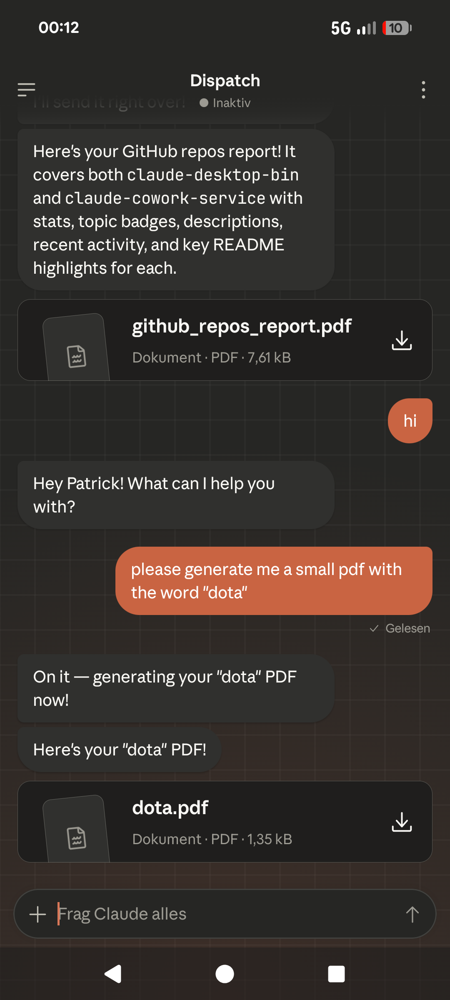

Claude Desktop spawns a long-running **dispatch orchestrator agent** (Anthropic internally calls it "Ditto"). This agent receives messages from your phone, delegates work to child sessions, and sends responses back via `SendUserMessage`.

```
Phone → Anthropic API → SSE → Claude Desktop → Ditto agent (via cowork-service)
  ├── Ditto calls SendUserMessage → response appears on phone
  ├── Ditto calls mcp__dispatch__start_task → child session spawned
  │     └── Child does the work (code, files, research, etc.)
  │     └── Child completes → Ditto reads transcript → Ditto replies to phone
  └── Ditto has access to all SDK MCP servers (Gmail, Drive, Chrome, etc.)
```

Dispatch runs inside the Cowork VM backend on every platform. On Linux the official build provides this backend natively (bundled in the package; requires `/dev/kvm`), so dispatched tasks execute in the same sandboxed VM as Cowork sessions.


## Known Limitations

### Quick Entry hotkey on GNOME Wayland

The Quick Entry global hotkey (default `Ctrl+Alt+Space`) works out of the box on **KDE Plasma**, **Hyprland**, and **Sway** via `xdg-desktop-portal` GlobalShortcuts.

On **GNOME**, the portal silently fails to register the hotkey. Run once after install:

```bash
claude-desktop --install-gnome-hotkey                 # default Ctrl+Alt+Space
claude-desktop --install-gnome-hotkey '<Super>space'  # or any accelerator
```

This binds the key directly via `gsettings`, bypassing the portal. See [wayland.md](wayland.md#quick-entry-hotkey-not-firing-on-gnome) for details. Run `claude-desktop --diagnose` to check hotkey status.

### Quick Entry hotkey command

Set your keyboard shortcut (GNOME, KDE, Sway, Hyprland) to:

```bash
claude-desktop --toggle
```

This toggles Quick Entry in ~5-25 ms via a Unix domain socket. If the app is not running, it starts it automatically.

### App identity on Wayland

`xdg-desktop-portal` resolves unsandboxed apps via the systemd user scope /
cgroup name. We launch under `app-claude-*.scope` (via `systemd-run --user --scope`)
and install the `.desktop` file as `claude.desktop`. The id `claude` matches
Chromium's autogenerated systemd scope (derived from `app.getName().toLowerCase()`),
so all identifiers - outer launcher scope, Chromium's inner scope, WM_CLASS,
Wayland `app_id`, and the .desktop basename - agree. KDE Plasma global
shortcuts and persistent xdg-desktop-portal RemoteDesktop authorizations
attach to the same id and survive across sessions.

- **Pinned taskbar entries**: if you had `com.anthropic.claude-desktop.desktop` pinned (from an earlier release), re-pin once after this update.
- **Custom X11 WM rules**: `WM_CLASS` / Wayland `app_id` is `claude`. Users who previously matched on `Claude` or `com.anthropic.claude-desktop` need to update their i3 / xmonad / awesome / bspwm / KWin rules. Named profiles (see [Multiple Profiles](#multiple-profiles)) get a `-<profile>` suffix on this class so each profile shows up as a separate app - write WM rules accordingly.
- **GNOME shell extension blacklist (Rounded Window Corners Reborn, Unite, Blur My Shell, ...)**: if you added `com.anthropic.claude-quick-entry` to your extension's exclude list to hide the opaque shadow rectangle behind Quick Entry, update that entry to `claude-quick-entry`.
- **NixOS**: the Nix package materialises a renamed Electron binary (`claude`) for correct Wayland `app_id`, but does not use `systemd-run --scope`. Portal identity may not resolve on GNOME Wayland - use `--install-gnome-hotkey` instead. Other sessions (KDE, Hyprland, Sway, X11) are unaffected.
- **Sandboxes / containers without a reachable user-systemd** (bwrap, distrobox, restricted Flatpaks): the launcher auto-detects when `$XDG_RUNTIME_DIR/systemd/private` is missing and skips the scope wrap. Portal identity may not resolve in these environments; the app still starts. If the socket exists but is still unreachable (SELinux, bind-mount filters), force the bypass with `--no-systemd-scope` or `CLAUDE_DISABLE_SYSTEMD_SCOPE=1`. See [#89](https://github.com/patrickjaja/claude-desktop-bin/issues/89).

## Cleanup
- **Clear stale Cowork sessions** (stuck "setting up workspace", or the model replaying old errors): remove the sessions dir and restart. Default profile uses `~/.config/Claude/`; with an `managed-settings.json` (3p) it's `~/.config/Claude-3p/`, and named profiles use `~/.config/Claude-<profile>/`.
  ```bash
  rm -rf ~/.config/Claude/local-agent-mode-sessions/
  ```


## See Also

- [tweakcc](https://github.com/Piebald-AI/tweakcc) - A great CLI tool for customizing Claude Code (system prompts, themes, UI). Same patching-JS-to-make-it-yours energy. Thanks to the Piebald team for their work.

## Legal Notice

> This is an **unofficial community project** for educational and research purposes.
> Claude Desktop is proprietary software owned by **Anthropic PBC**.
>
> This repository contains only build scripts and patches - not the Claude Desktop
> application itself. The upstream binary is downloaded directly from Anthropic
> during the build process.
>
> This project is not affiliated with, endorsed by, or sponsored by Anthropic.
> "Claude" is a trademark of Anthropic PBC.

---

<p align="center"><sub>Built with ❤️ for the Linux community</sub></p>
