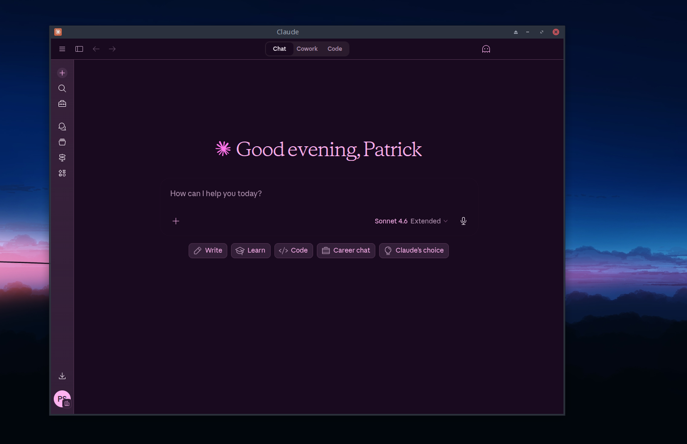
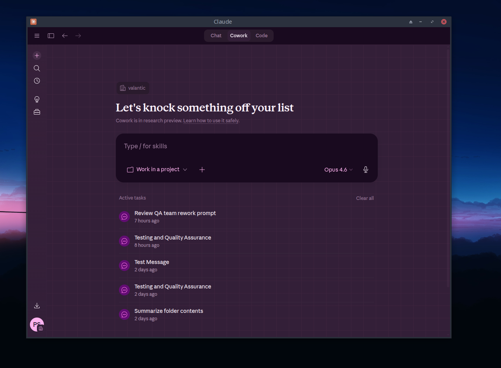
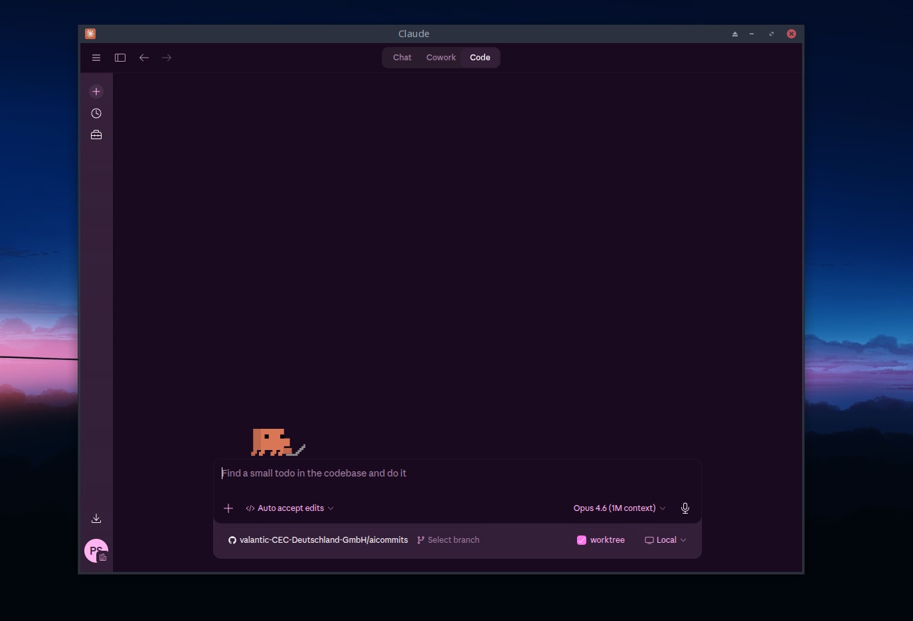
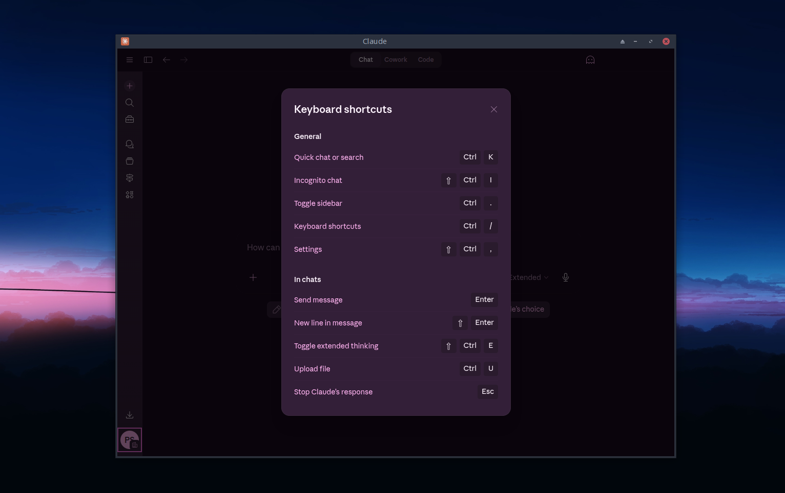

# Claude Desktop Custom Themes

Create your own themes for Claude Desktop on Linux by overriding CSS variables.

## Sweet Theme Preview

| Chat | Cowork |
|------|--------|
|  |  |

| Code | Dialog |
|------|--------|
|  |  |

## How It Works

The theme system injects CSS variable overrides into **all** Claude Desktop windows:

| Window | URL | What's themed |
|--------|-----|---------------|
| **Main chat** | `https://claude.ai/...` | Full conversation UI, sidebar, settings |
| **Quick Entry** | `file://...quick-window.html` | Floating prompt box (hotkey popup) |
| **Find-in-Page** | `file://...find-in-page.html` | Search overlay |
| **About** | `file://...about.html` | App info dialog |

Themes override two variable systems:
1. **HSL design tokens** (`--bg-000`, `--text-100`, `--accent-brand`, etc.) — Tailwind CSS utilities compile to `hsl(var(--bg-000))`, so overriding these variables automatically themes all utility classes.
2. **Legacy hex variables** (`--claude-background-color`, `--claude-foreground-color`, etc.) — used by renderer window chrome (title bar, Quick Entry container, body backgrounds).

## Dark Mode Requirement

Themes override CSS variables with `!important` on `:root, html` — this means the theme colors apply **regardless** of Claude Desktop's light/dark mode setting. However, the built-in themes are designed as dark themes (except `catppuccin-latte`).

**Recommendation:** Set Claude Desktop to **dark mode** (Settings → Appearance → Dark) before enabling a dark theme. Otherwise the app's theme-switching logic (toggling `.darkTheme` class on `<body>`) won't fire, and some hardcoded light-mode styles (e.g., `#faf9f5` backgrounds in window-shared.css) may briefly flash before CSS injection takes effect.

Light-theme users should use `catppuccin-latte` or create a custom light theme.

## Configuration

Place your theme config at `~/.config/Claude/claude-desktop-bin.json`:

```json
{
  "activeTheme": "sweet",
  "themes": {
    "my-custom-theme": {
      "--bg-000": "220 17% 20%",
      "--bg-100": "220 17% 18%",
      "--text-000": "219 28% 88%",
      "--claude-background-color": "#2E3440",
      "--claude-foreground-color": "#D8DEE9"
    }
  }
}
```

- Set `activeTheme` to a built-in name or a key in your `themes` object.
- Built-in themes: `sweet`, `nord`, `catppuccin-mocha`, `catppuccin-frappe`, `catppuccin-latte`, `catppuccin-macchiato`.
- Restart Claude Desktop to apply changes.

### Chat Font Override

You can override the chat font per-theme or globally. The value is any valid CSS `font-family` string:

```json
{
  "activeTheme": "nord",
  "chatFont": "'Fira Sans', sans-serif",
  "themes": {
    "my-custom-theme": {
      "--bg-000": "220 17% 20%",
      "chatFont": "'JetBrains Mono', monospace"
    }
  }
}
```

- Per-theme `chatFont` (inside a theme object) takes precedence over the global `chatFont`.
- This overrides the `font-claude-response-body` and `font-claude-response-title` CSS classes used by Claude's message text in both Chat and Cowork tabs.
- The font must be installed on your system.
- Only system-installed fonts are supported (no Google Fonts / remote loading).

To find available fonts on your system:

```bash
# List all installed font families
fc-list : family | sort -u

# Search for a specific font
fc-list : family | grep -i "fira"

# Show fonts with style info
fc-list : family style | grep -i "mono"
```

### Custom CSS (raw rules)

CSS variables only get you so far. The main chat UI (claude.ai) is built with **Tailwind CSS v4**, whose
utility classes (e.g. `.bg-bg-100`, `.border-border-300`) live in CSS `@layer`s and win the cascade over
a plain `:root` variable override. So for surfaces whose color is painted by a utility class - the
sidebar, some backgrounds, borders - overriding `--bg-000` alone doesn't change them. The `customCss`
field lets you inject raw CSS rules that target those elements directly.

`customCss` accepts either a single string or an array of strings (arrays are joined with newlines).
It can live at the **top level** (applies to whatever theme is active) and/or **inside a theme object**
(applies only when that theme is active). Both are injected **after** the variable declarations and the
built-in element overrides. Per-theme `customCss` is appended after the global one, so it takes
precedence.

```json
{
  "activeTheme": "nord",
  "customCss": "/* applies under every theme */",
  "themes": {
    "nord": {
      "--bg-000": "220 16% 22%",
      "customCss": [
        "nav.bg-bg-100.bg-bg-100{background-image:none!important;background-color:hsl(var(--bg-200))!important;border-right:2px solid hsl(var(--accent-main-100) / 0.55)!important}",
        "[contenteditable=\"true\"], .ProseMirror{border:1px solid hsl(var(--accent-main-100) / 0.4)!important;border-radius:10px!important}"
      ]
    }
  }
}
```

On startup (run `claude-desktop` from a terminal) you'll see
`[CustomThemes] customCss appended (N chars)` confirming your rules were injected.

#### Beating Tailwind v4 utilities (verified, important)

These two techniques are what make the example above actually work - and they're the difference between
a rule that paints and one that silently no-ops:

1. **Out-specify the utility by doubling its class.** A plain `!important` in your `customCss` does **not**
   reliably beat a Tailwind v4 utility, because `@layer` ordering and the framework's own weights can win.
   The robust, hash-free fix is to **repeat the utility class** so your selector has higher specificity:
   `nav.bg-bg-100.bg-bg-100{...}` (two `.bg-bg-100` = specificity 0,2,0) beats `.bg-bg-100` (0,1,0). This
   uses Tailwind's **stable token classes** (`bg-bg-100`, `border-border-300`, `text-text-100`, …), which
   are far more durable than minified component-class hashes.
2. **Backgrounds are often gradients - clear `background-image`.** The sidebar fill, for instance, is a
   `bg-gradient-to-t` utility, not a flat color. Setting `background-color` alone does nothing visible; you
   must also set `background-image:none!important` before your `background-color` shows through.

> **Selectors drift between releases.** Prefer stable Tailwind token classes (`bg-bg-*`, `text-text-*`,
> `border-border-*`) and `[contenteditable]`/`[role=*]`/`[aria-*]` attributes over minified component-class
> hashes, and re-check your rules after an upstream update. To find the current element for a surface, open
> the main view's DevTools and walk up from a known item until you hit the element whose computed
> `background` is the one you see (note: with Tailwind v4 gradients, trust the rendered pixels - DevTools'
> *Computed* panel can mis-report the background as unchanged). The extraction steps below also help.

## Extracting HTML & CSS for Reference

To inspect the actual HTML structure and CSS classes used by each window:

### 1. Extract the app bundle

```bash
# Place Claude.msix in the project root, then:
mkdir -p /tmp/claude-inspect
7z x -o/tmp/claude-inspect Claude.msix -y
asar extract /tmp/claude-inspect/app/resources/app.asar /tmp/claude-inspect/app
```

### 2. Inspect the HTML files

```bash
# List all renderer HTML files
find /tmp/claude-inspect/app/.vite/renderer -name "*.html"

# Main window (title bar chrome, empty body — claude.ai loads as WebContentsView)
cat /tmp/claude-inspect/app/.vite/renderer/main_window/index.html

# Quick Entry (the floating prompt box — only HTML with actual body content)
cat /tmp/claude-inspect/app/.vite/renderer/quick_window/quick-window.html

# Find-in-Page (search overlay, transparent background)
cat /tmp/claude-inspect/app/.vite/renderer/find_in_page/find-in-page.html

# About window (app info)
cat /tmp/claude-inspect/app/.vite/renderer/about_window/about.html
```

### 3. Inspect CSS variables

Each HTML file has an inline `<style>` block (~4000 lines) containing:
- Compiled Tailwind CSS utilities
- CSS variable definitions from `window-shared.css`
- Window-specific styles (e.g., Quick Entry container)

```bash
# Extract just the CSS variable definitions
grep -E '^\s*--' /tmp/claude-inspect/app/.vite/renderer/main_window/index.html | head -80

# Find all Tailwind utility classes that use a specific variable
grep 'var(--bg-000)' /tmp/claude-inspect/app/.vite/renderer/main_window/index.html

# See the Quick Entry specific styles (at end of style block)
grep -A5 '.container' /tmp/claude-inspect/app/.vite/renderer/quick_window/quick-window.html
```

### 4. Inspect the claude.ai web content (main chat UI)

The main chat UI loads from `claude.ai` as a separate BrowserView. To inspect it:
1. Launch Claude Desktop
2. Set env: `ELECTRON_ENABLE_LOGGING=1 claude-desktop`
3. Or use Electron DevTools if available

The claude.ai content uses the same HSL design tokens (`--bg-000`, `--text-100`, etc.) defined in the renderer CSS.

## CSS Variable Reference

### HSL Design Tokens (Tailwind)

These control the main UI colors. Values are HSL components without `hsl()` wrapper (e.g., `285 50% 8%`).

| Variable | Purpose |
|----------|---------|
| `--bg-000` | Primary background (deepest) |
| `--bg-100` | Secondary background |
| `--bg-200` | Tertiary background |
| `--bg-300` | Elevated surface |
| `--bg-400` | Higher elevation |
| `--bg-500` | Highest elevation |
| `--text-000` | Primary text (brightest) |
| `--text-100` | Primary text (alias) |
| `--text-200` | Secondary text |
| `--text-300` | Secondary text (alias) |
| `--text-400` | Muted text |
| `--text-500` | Most muted text |
| `--accent-brand` | Brand accent color |
| `--accent-main-000` to `--accent-main-900` | Primary accent scale |
| `--accent-secondary-000` to `--accent-secondary-900` | Secondary accent scale |
| `--accent-pro-000` to `--accent-pro-900` | Pro/premium accent scale |
| `--border-100` to `--border-400` | Border colors (light to heavy) |
| `--danger-000` to `--danger-900` | Error/danger colors |
| `--warning-000` to `--warning-900` | Warning colors |
| `--success-000` to `--success-900` | Success colors |
| `--oncolor-100` to `--oncolor-300` | Text on colored backgrounds |
| `--pictogram-100` to `--pictogram-400` | Icon colors |
| `--white`, `--black` | Constants |
| `--clay`, `--kraft`, `--book-cloth`, `--manilla` | Named brand colors |

### Legacy Hex Variables

These control renderer window chrome. Values are hex colors (e.g., `#190a1e`).

| Variable | Purpose |
|----------|---------|
| `--claude-accent-clay` | Accent color (logo, highlights) |
| `--claude-foreground-color` | Primary text color |
| `--claude-background-color` | Window background |
| `--claude-secondary-color` | Secondary/muted text |
| `--claude-border` | Light border (with alpha) |
| `--claude-border-300` | Medium border (with alpha) |
| `--claude-border-300-more` | Heavy border (with alpha) |
| `--claude-text-100` | Bright text |
| `--claude-text-200` | Medium text |
| `--claude-text-400` | Dim text |
| `--claude-text-500` | Dimmest text |
| `--claude-description-text` | Description/hint text |

### What Each Variable Affects

**Quick Entry window:**
- `.container` gradient: overridden by theme → uses `--bg-100` → `--bg-000`
- `.container:before` border: overridden by theme → uses `--border-300`
- Textarea text: `--claude-foreground-color`
- Textarea placeholder: `--claude-text-500`
- Body background: `--claude-background-color` (transparent, but used as fallback)

**Main chat (claude.ai):**
- All backgrounds: `--bg-*` (via Tailwind utilities like `.bg-bg-000`)
- All text: `--text-*` (via Tailwind utilities like `.text-text-100`)
- Borders: `--border-*`
- Buttons/accents: `--accent-main-*`
- Prose/markdown: `--tw-prose-*` (overridden automatically from `--text-*` and `--border-*`)

**Title bar area:**
- Background: `--claude-background-color`
- Text: `--claude-foreground-color`
- Drag handle text: `--text-000`

## Tips for Theme Creators

1. **Start with a built-in theme** — copy one of the JSON files from `themes/` and modify it.
2. **HSL format** — use `"hue saturation% lightness%"` (e.g., `"285 50% 8%"`), not `hsl(...)`.
3. **Hex format** — legacy `--claude-*` variables use hex (e.g., `"#190a1e"`). Include alpha for borders (e.g., `"#b496b420"`).
4. **Test incrementally** — change a few variables, restart, check all windows.
5. **Check all views** — open Quick Entry (hotkey), Find-in-Page (Ctrl+F), and About to verify.
6. **Contrast matters** — ensure `--text-000` has sufficient contrast against `--bg-000`.

## Cleanup

```bash
rm -rf /tmp/claude-inspect
```
